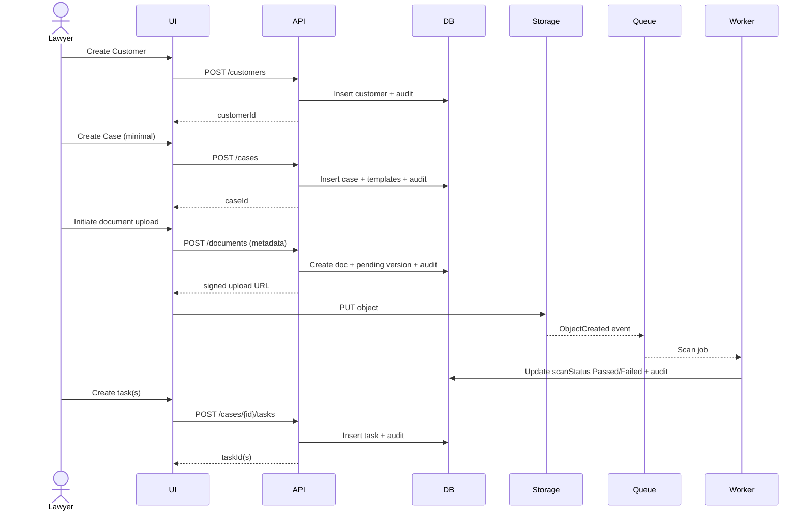
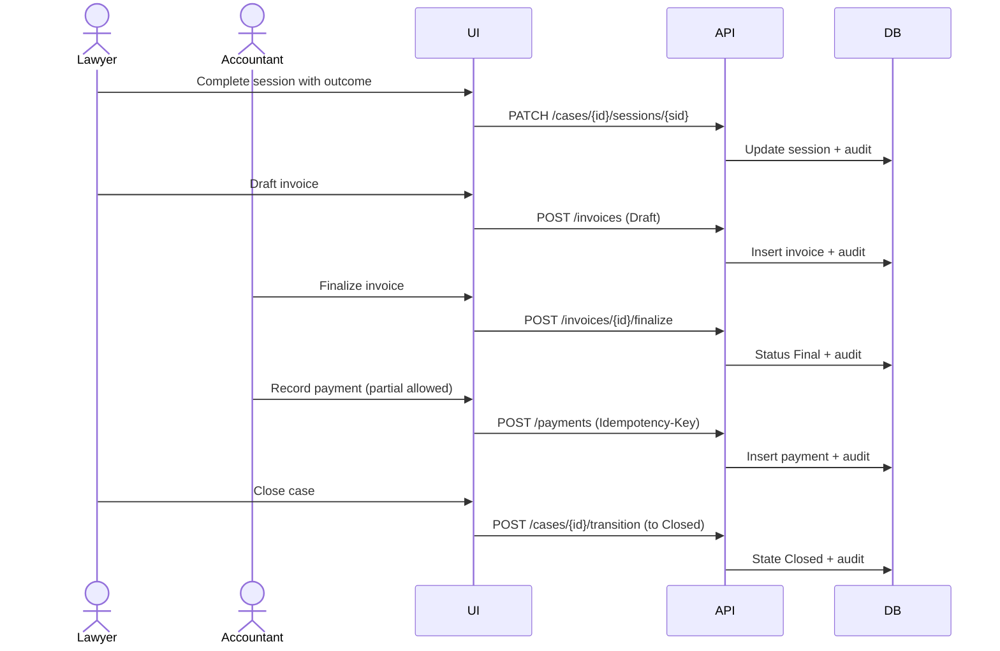
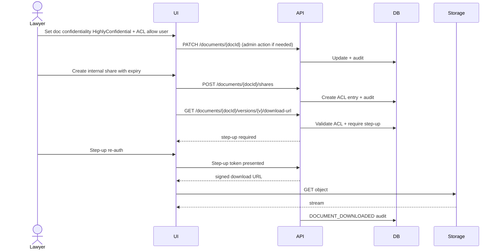

# Appendix

## Law Office Management Web Application (LOMA) — Wave 1 MVP

**Version:** 1.0  
**Date:** 2026-02-23  

---

## A. Permission Matrix (MVP)

**Legend:** V=view, C=create, E=edit, D=delete, A=approve, X=export

| Module / Action | Lawyer | Accountant | Tenant Admin | System Admin |
|---|---:|---:|---:|---:|
| Customers | V/C/E (scoped) | V (finance views) | V/C/E/D | V/C/E/D |
| Contacts | V/C/E (scoped) | V (limited) | V/C/E/D | V/C/E/D |
| Parties & Relationships | V/C/E (scoped) | V (limited) | V/C/E/D | V/C/E/D |
| Cases | V/C/E (membership) | V (limited headers) | V/C/E/D | V/C/E/D |
| Case Memberships | — | — | Manage | Manage |
| Tasks | V/C/E/D (membership) | — | V/C/E/D | V/C/E/D |
| Sessions | V/C/E/D (membership) | — | V/C/E/D | V/C/E/D |
| Filings | V/C/E/D (membership) | — | V/C/E/D | V/C/E/D |
| Notes | C/V (append-only) | — | C/V | C/V |
| Communications | V/C/E/D (membership) | — | V/C/E/D | V/C/E/D |
| Documents | V/C/E (membership) | V (finance-only) | V/C/E/D + BreakLock + Hold | Full |
| HighlyConfidential docs | Explicit ACL allow required | Explicit ACL allow required | Manage ACL | Manage ACL |
| Invoices | V/C/E Draft (own cases) | V/C/E/D + Finalize + X | V/C/E/D + Void + X | Full |
| Payments | V (summary only) | C/E/X | C/E/X | Full |
| Expenses | V/C (own cases) | V/C/E/A/X | V/C/E/A/X | Full |
| Wages | — | V/C/E/X | optional | Full |
| Reports | V/X (limited) | V/X | V/X | Full |
| Admin master data | — | — | Full (tenant) | Full |
| Audit logs | limited | limited | Full tenant | Full platform |

---

## B. Audit Event Catalog (MVP)

**Security/Auth**

- AUTH_LOGIN_SUCCESS / AUTH_LOGIN_FAILURE
- AUTH_STEP_UP_REQUIRED / AUTH_STEP_UP_SUCCESS / AUTH_STEP_UP_FAILURE
- USER_CREATED / USER_DEACTIVATED / USER_REACTIVATED
- ROLE_ASSIGNED / ROLE_REMOVED

**Customer**

- CUSTOMER_CREATED / CUSTOMER_UPDATED
- CONTACT_CREATED / CONTACT_UPDATED
- ADDRESS_CREATED / ADDRESS_UPDATED
- PARTY_CREATED / PARTY_UPDATED
- PARTY_RELATIONSHIP_CREATED / PARTY_RELATIONSHIP_UPDATED
- CUSTOMER_CHECKLIST_ITEM_UPDATED
- CUSTOMER_REQUIRED_DOC_STATUS_CHANGED

**Case**

- CASE_CREATED / CASE_UPDATED
- CASE_STATE_CHANGED
- CASE_ON_HOLD_SET / CASE_ON_HOLD_CLEARED
- CASE_REOPENED
- CASE_MEMBERSHIP_ADDED / CASE_MEMBERSHIP_REMOVED / CASE_MEMBERSHIP_ROLE_CHANGED
- CASE_REQUIRED_DOC_STATUS_CHANGED

**Tasks**

- TASK_CREATED / TASK_UPDATED / TASK_STATUS_CHANGED / TASK_REASSIGNED

**Sessions**

- SESSION_CREATED / SESSION_UPDATED / SESSION_RESCHEDULED / SESSION_CANCELLED / SESSION_COMPLETED

**Filings**

- FILING_CREATED / FILING_UPDATED / FILING_STATUS_CHANGED

**Notes**

- NOTE_CREATED

**Communications**

- COMM_CREATED / COMM_UPDATED

**Documents**

- DOCUMENT_CREATED
- DOCUMENT_UPLOAD_INITIATED
- DOCUMENT_SCAN_PASSED / DOCUMENT_SCAN_FAILED
- DOCUMENT_VERSION_CREATED
- DOCUMENT_CHECKED_OUT / DOCUMENT_CHECKED_IN / DOCUMENT_LOCK_BROKEN
- DOCUMENT_VIEWED / DOCUMENT_DOWNLOADED
- DOCUMENT_SHARED_INTERNAL / DOCUMENT_SHARE_REVOKED
- DOCUMENT_SOFT_DELETED / DOCUMENT_RESTORED / DOCUMENT_PURGED
- LEGAL_HOLD_APPLIED / LEGAL_HOLD_RELEASED

**Accounting**

- INVOICE_CREATED / INVOICE_UPDATED / INVOICE_FINALIZED / INVOICE_SENT / INVOICE_VOIDED / INVOICE_PAID
- PAYMENT_CREATED / PAYMENT_UPDATED
- EXPENSE_CREATED / EXPENSE_SUBMITTED / EXPENSE_APPROVED / EXPENSE_REJECTED
- WAGE_CREATED / WAGE_UPDATED / WAGE_MARKED_PAID

**Exports**

- EXPORT_GENERATED (invoicePdf, reportCsv)

---

## C. Sequence Diagrams (Critical Journeys)

### Journey 1: New Customer → Create Case → Upload Docs → Assign Tasks



### Journey 2: Session update → Invoice → Payment → Close Case



### Journey 3: Internal time-bound share for HighlyConfidential doc



---

## D. Folder Hierarchy Examples

```text
/tenants/t1/customers/c9/cases/m55/documents/contract/d91/versions/v1
/tenants/t1/customers/c9/cases/m55/documents/contract/d91/versions/v2
/tenants/t1/customers/c9/cases/m55/documents/pleading/d77/versions/v1
```

---

## E. MVP Definition of Done (DoD)

- AuthN/AuthZ:
  - OIDC integrated
  - RBAC/ABAC enforced everywhere
  - step-up re-auth for sensitive actions
- Bilingual:
  - EN/AR with RTL
  - tenant timezone + locale formats
- Customer/Case:
  - identity validation + uniqueness
  - templates and completeness engine
  - multi-party support
  - sessions calendar with reschedule history
  - tasks with fixed reminders and notifications
  - notes append-only, filings/comms configurable
- Documents:
  - Azure Blob + S3 storage provider abstraction
  - signed upload URLs
  - scan gate + quarantine
  - immutable versions, check-out/in, confidentiality
  - internal sharing, legal hold, soft delete/restore
- Accounting:
  - invoices with tax/discount
  - payments no overpay
  - expenses multi-step approvals
  - wages records
  - reports CSV + invoice PDF
- Ops:
  - Dev/Test/Prod
  - backups + PITR, restore tested
  - monitoring dashboards + alerts
