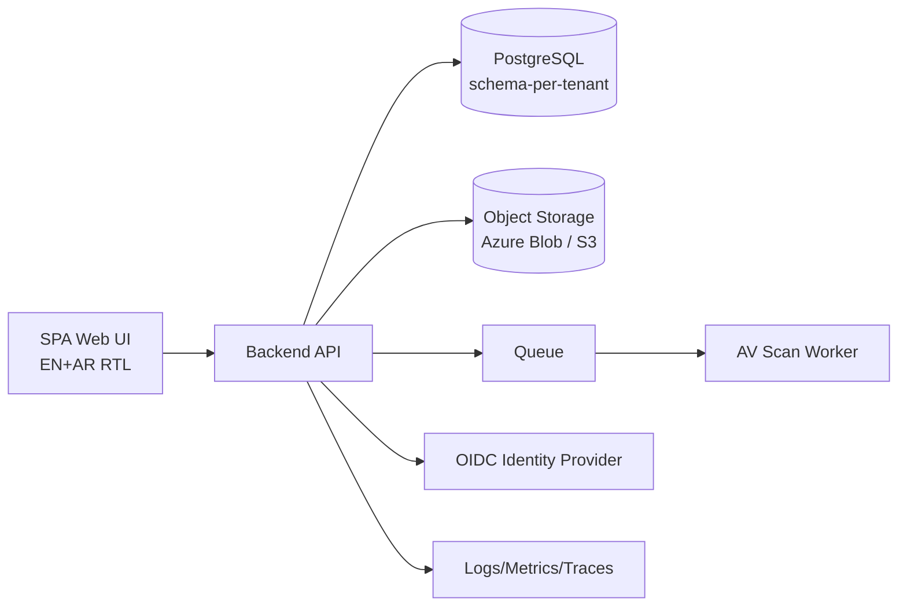

# Software Requirements Specification (SRS)
## Law Office Management Web Application (LOMA)

**Version:** 1.0  
**Date:** 2026-02-23  
**Scope:** Wave 1 MVP requirements (functional + non-functional)

---

## 1. System Overview

### 1.1 System Context
The system is a multi-tenant web application for law firms. Users authenticate via an OIDC identity provider. The app stores business metadata in PostgreSQL (schema-per-tenant) and document binaries in external object storage (Azure Blob or S3-compatible). A queue + worker performs malware scanning and updates document version status.

### 1.2 Users and Roles
- Lawyer
- Accountant
- Tenant Admin
- System Admin (platform)

### 1.3 Core Constraints
- External object storage is mandatory for binaries.
- Hierarchical storage path is mandatory.
- Metadata and permissions stored in DB; access enforced by API.
- Separation of duties: Accountant controls finalized finance records.
- English + Arabic required in MVP.

---

## 2. Functional Requirements

### 2.1 Tenancy (FR-TEN)
- FR-TEN-01: System SHALL enforce tenant isolation on every request.
- FR-TEN-02: System SHALL store business data per tenant in a dedicated DB schema.
- FR-TEN-03: System SHALL ensure all storage paths begin with `/tenants/{tenantId}/`.
- FR-TEN-04: System SHALL prevent cross-tenant access even if a user guesses resource IDs.

### 2.2 Authentication (FR-AUTHN)
- FR-AUTHN-01: System SHALL authenticate via OIDC Authorization Code + PKCE.
- FR-AUTHN-02: System SHALL validate JWT access tokens server-side.
- FR-AUTHN-03: System SHALL map users to tenantId and roles at login.

### 2.3 Session and Step-up (FR-SESSION)
- FR-SESSION-01: System SHALL enforce idle session timeout in UI.
- FR-SESSION-02: System SHALL require step-up re-auth for sensitive actions:
  - view/download HighlyConfidential document
  - break document lock
  - apply/release legal hold
  - export finance reports
- FR-SESSION-03: Step-up attempts SHALL be audited.

### 2.4 Authorization (FR-AUTHZ)
- FR-AUTHZ-01: System SHALL enforce RBAC permissions for actions.
- FR-AUTHZ-02: System SHALL enforce ABAC constraints:
  - tenant boundary
  - case membership for case content
  - document ACL and confidentiality rules
- FR-AUTHZ-03: HighlyConfidential documents SHALL require explicit ACL allow.
- FR-AUTHZ-04: Case membership SHALL support roles: CaseOwner, CaseMember, ReadOnly.

### 2.5 Customer Management (FR-CUST)
- FR-CUST-01: System SHALL support Individual and Organization customers.
- FR-CUST-02: Organization customer SHALL require registrationId and taxId.
- FR-CUST-03: Individual customer SHALL require nationalId or passportNumber.
- FR-CUST-04: System SHALL enforce uniqueness per tenant for taxId, registrationId, nationalId, passportNumber when present.
- FR-CUST-05: System SHALL support multiple addresses per customer.
- FR-CUST-06: System SHALL store contacts per customer (no global address book in MVP).
- FR-CUST-07: Contact roles SHALL be configurable by Tenant Admin.
- FR-CUST-08: System SHALL maintain a Party entity reusable for opposing/external parties.
- FR-CUST-09: Party relationship types SHALL be configurable; relationships recorded and auditable.
- FR-CUST-10: System SHALL support customer compliance checklist templates and per-customer status tracking.
- FR-CUST-11: System SHALL prompt for required customer documents defined by templates.
- FR-CUST-12: System SHALL compute customer financial summary (derived from accounting).

### 2.6 Case Lifecycle (FR-CASE)
- FR-CASE-01: Case types SHALL be configurable per tenant (create/edit/disable).
- FR-CASE-02: Case type SHALL link templates: required docs, default tasks, optional session placeholders, optional participant placeholders.
- FR-CASE-03: System SHALL generate systemCaseRef as CASE-{YYYY}-{SEQUENCE}.
- FR-CASE-04: System SHALL store courtCaseNumber as optional field.
- FR-CASE-05: System SHALL support case states: Intake, Open, Active, Pending, Closed, Archived.
- FR-CASE-06: System SHALL support OnHold flag with reason and dates.
- FR-CASE-07: System SHALL allow Reopen from Closed→Active with reason and audit.
- FR-CASE-08: Archived cases SHALL be read-only.
- FR-CASE-09: Cases SHALL support multiple customers and multiple opposing parties.
- FR-CASE-10: Participant roles SHALL be configurable; each participant has visibilityScope.
- FR-CASE-11: Court SHALL be a separate entity; court details may be stored as free-text notes in MVP.
- FR-CASE-12: System SHALL provide sessions calendar with reschedule history and reason.
- FR-CASE-13: System SHALL provide tasks with assignments, fixed reminders, and notifications.
- FR-CASE-14: Notes SHALL be append-only in MVP.
- FR-CASE-15: Filing types SHALL be configurable; statuses supported (Draft/Filed/Accepted/Rejected/Withdrawn).
- FR-CASE-16: Communications log SHALL exist at both customer and case level; types configurable.

### 2.7 Completeness Engine (FR-COMP)
- FR-COMP-01: System SHALL compute Case completeness % using fixed weights in MVP:
  - required fields: 40%
  - required docs: 40%
  - required participants/checklists: 20%
- FR-COMP-02: System SHALL show missing items list in UI.
- FR-COMP-03: Completeness SHALL NOT block progress (except validation constraints).

### 2.8 Document Management (FR-DOC)
- FR-DOC-01: System SHALL store binaries in external object storage; metadata and permissions in DB.
- FR-DOC-02: Storage path SHALL follow:
  `/tenants/{tenantId}/customers/{customerId}/cases/{caseId}/documents/{docType}/{docId}/versions/{versionId}`
- FR-DOC-03: System SHALL issue pre-signed upload URLs after authorization.
- FR-DOC-04: System SHALL validate upload content-type and checksum; enforce size limits.
- FR-DOC-05: System SHALL enforce malware scan gate:
  - Pending hidden
  - Passed visible
  - Failed quarantined
- FR-DOC-06: Document versions SHALL be immutable; no rollback in MVP.
- FR-DOC-07: System SHALL support explicit check-out/in with lock expiry 4 hours.
- FR-DOC-08: Tenant Admin SHALL be able to break locks (step-up + audit).
- FR-DOC-09: System SHALL support confidentiality levels and enforce HighlyConfidential rules.
- FR-DOC-10: System SHALL support internal time-bound sharing to existing users.
- FR-DOC-11: Retention policies SHALL be seeded and visible; not editable in MVP.
- FR-DOC-12: System SHALL support legal hold at case and document level.
- FR-DOC-13: Deletion SHALL be soft delete + restore; purge via retention job only.

### 2.9 Storage Providers (FR-STO)
- FR-STO-01: System SHALL provide a storage abstraction interface with Azure Blob and S3-compatible implementations.
- FR-STO-02: Tenant SHALL be configurable to use shared or dedicated storage.
- FR-STO-03: Provider credentials SHALL be stored via secret manager references (no plaintext).

### 2.10 Accounting (FR-ACC)
- FR-ACC-01: Invoice SHALL support generic line items and totals.
- FR-ACC-02: Invoice SHALL support invoice-level tax% and discount%.
- FR-ACC-03: Invoice numbering SHALL be INV-{YYYY}-{SEQUENCE}.
- FR-ACC-04: Lawyer MAY create draft invoices (tenant setting).
- FR-ACC-05: Only Accountant SHALL finalize invoices in MVP.
- FR-ACC-06: Final invoices SHALL be read-only; void by Accountant or Tenant Admin with reason.
- FR-ACC-07: Payments SHALL be allocated to a single invoice only.
- FR-ACC-08: Partial payments SHALL be allowed.
- FR-ACC-09: Overpayments SHALL be rejected (no credit balance in MVP).
- FR-ACC-10: Payment creation SHALL be idempotent via Idempotency-Key.
- FR-ACC-11: Expense SHALL support multi-step role-based approvals.
- FR-ACC-12: Receipts SHALL be optional for expenses.
- FR-ACC-13: Wages records SHALL be supported with CSV export.
- FR-ACC-14: Reports SHALL be available as CSV exports, audited.

### 2.11 Search (FR-SEARCH)
- FR-SEARCH-01: Global search SHALL cover Customers, Cases, Documents (metadata), Invoices.
- FR-SEARCH-02: Search SHALL support Arabic via normalized fields/collation.
- FR-SEARCH-03: Search results SHALL be permission filtered.
- FR-SEARCH-04: Filters SHALL be provided per entity as approved.

---

## 3. Non-Functional Requirements

### 3.1 Security (NFR-SEC)
- NFR-SEC-01: TLS 1.2+ required for all endpoints.
- NFR-SEC-02: Encryption at rest for DB and storage (provider native).
- NFR-SEC-03: Secrets stored in secret manager.
- NFR-SEC-04: Signed URLs must be short-lived; upload URL TTL default 15 minutes.
- NFR-SEC-05: Rate limiting for auth, exports, signed URL issuance.
- NFR-SEC-06: Audit logs immutable append-only.

### 3.2 Privacy & Compliance (NFR-COMP)
- NFR-COMP-01: Retention is configurable later; MVP uses seeded defaults.
- NFR-COMP-02: Legal hold must block purge and retention actions.

### 3.3 Performance (NFR-PERF)
- NFR-PERF-01: Pagination on all list endpoints; cursor-based for large lists.
- NFR-PERF-02: File transfers use direct-to-storage; API not used as file proxy.
- NFR-PERF-03: Metadata search P95 ≤ 500ms under normal load (assumption).

### 3.4 Availability & DR (NFR-AVAIL)
- NFR-AVAIL-01: MVP single-region.
- NFR-AVAIL-02: DB PITR enabled; daily backups.
- NFR-AVAIL-03: Storage soft delete + versioning enabled.
- NFR-AVAIL-04: Restore test performed in Test environment.

### 3.5 Observability (NFR-OBS)
- NFR-OBS-01: Structured logs with correlation IDs.
- NFR-OBS-02: Metrics dashboards for API, DB, storage, queue, worker.
- NFR-OBS-03: Alerts on thresholds (errors, latency, queue depth, scan failures).

### 3.6 Globalization (NFR-GLOB)
- NFR-GLOB-01: English + Arabic (RTL) supported in MVP.
- NFR-GLOB-02: Tenant default timezone; timestamps stored UTC.
- NFR-GLOB-03: Locale formatting for dates/numbers.
- NFR-GLOB-04: Single currency per tenant.

---

## 4. System Interfaces
- OIDC IdP (Auth)
- Object storage provider (Azure Blob/S3)
- Queue/worker for scanning
- Observability stack (logs/metrics/traces)

