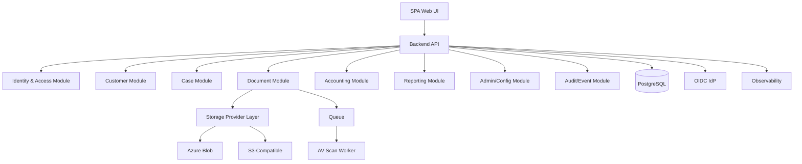
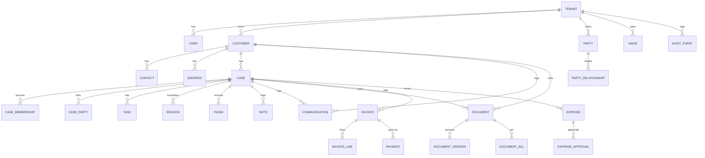

# Technical Design Document (TDD) / System Architecture
## Law Office Management Web Application (LOMA) — Wave 1 MVP

**Version:** 1.0  
**Date:** 2026-02-23  

---

## 1. Architectural Decisions (Final)

### 1.1 Architecture Style
- **Modular monolith** backend (MVP) with strict module boundaries:
  - Identity & Access
  - Customer
  - Case
  - Document
  - Accounting
  - Reporting
  - Admin & Configuration
  - Audit/Eventing
- Rationale:
  - Faster delivery and simpler operations for MVP
  - Keeps boundaries explicit for future service extraction

### 1.2 Tenancy
- **Schema-per-tenant** in PostgreSQL for all tenants in MVP.
- Enterprise dedicated DB deferred to later phases.

### 1.3 API Approach
- **REST** API with versioning: `/api/v1`
- Cursor-based pagination for high-volume lists
- Idempotency for finance writes (payments, optionally invoice create) via `Idempotency-Key`
- Concurrency control via rowVersion/ETag fields on mutable entities

### 1.4 Document Storage
- Binaries stored in object storage.
- Metadata + permissions stored in DB.
- Pre-signed upload URLs for direct client upload (MVP focus).
- Malware scanning gate blocks visibility until Passed.
- Immutable versions; explicit check-out/in; admin lock break.

### 1.5 Globalization
- EN + AR (RTL) required in MVP.
- Tenant timezone default; store UTC.

---

## 2. Logical Architecture

---

## 3. Deployment Architecture (Azure-ready, provider-agnostic)

**Compute**
- Web UI: static hosting + CDN
- API: containerized service (App Service / AKS / ECS equivalent)
- Worker: containerized service

**Data**
- PostgreSQL (managed service recommended)
- Object storage (Azure Blob / S3)
- Queue (Service Bus / Storage Queue / SQS equivalent)

**Secrets**
- Secret manager (Key Vault / Secrets Manager equivalent)

**Observability**
- Centralized logging, metrics, tracing

---

## 4. Data Architecture

### 4.1 Core Entities (High-level)
- Tenant, User, Role, CaseMembership
- Customer, Contact, Address
- Party, PartyRelationship, CaseParty
- Case, Task, Session, Filing, Note, Communication
- Document, DocumentVersion, DocumentAclEntry, LegalHold
- Invoice, InvoiceLineItem, Payment
- Expense, ExpenseApprovalStep, Wage
- AuditEvent, OutboxEvent

### 4.2 ERD (Mermaid)

### 4.3 Indexing and Constraints (minimum)
- Unique constraints per tenant:
  - customer.taxId, customer.registrationId, customer.nationalId, customer.passportNumber (nullable unique)
- Case references:
  - case.systemCaseRef unique per tenant
  - invoice.invoiceNumber unique per tenant
- Document:
  - documentVersion checksum indexed for integrity checks (optional)
- Search:
  - Trigram indexes on names/title fields (optional) for fast partial matches

---

## 5. Storage Provider Abstraction

### 5.1 Interface
`IStorageProvider`:
- `CreateUploadUrl(objectKey, contentType, checksum, size, ttlMinutes) -> signedUrl + requiredHeaders`
- `CreateDownloadUrl(objectKey, ttlMinutes) -> signedUrl`
- `GetObjectMetadata(objectKey) -> size, etag, lastModified` (optional)
- `DeleteObject(objectKey)` (used by purge jobs)

### 5.2 Tenant Storage Configuration
- Mode: Shared | Dedicated
- ProviderType: AzureBlob | S3Compatible
- Settings:
  - container/bucket, endpoint/region, basePrefix
  - credentials reference in secret manager

---

## 6. Document Scanning Pipeline

### 6.1 States
- Pending: hidden
- Passed: visible
- Failed: quarantined

### 6.2 Flow
1. API issues upload URL, creates pending version
2. Storage emits event (or polling) → queue message
3. Worker pulls object, scans, updates status
4. On Passed: mark currentVersionId = latest passed
5. On Failed: quarantine and block downloads

---

## 7. Security Architecture

### 7.1 AuthN
- OIDC Authorization Code + PKCE
- JWT validation and claims mapping

### 7.2 AuthZ (RBAC + ABAC)
- RBAC: role permissions
- ABAC:
  - tenant match
  - case membership
  - document ACL and confidentiality

### 7.3 Step-up Re-auth
- Use IdP re-auth prompt (max_age) for sensitive actions.
- Record audit events for step-up.

### 7.4 Audit Logging
- Append-only `audit_events`
- Include: eventType, actorUserId, tenantId, entityType, entityId, payload (minimal), timestamp, correlationId

### 7.5 Threat Model Highlights
- Broken object-level authorization → centralized checks + tests
- Signed URL leakage → short TTL + server-side issuance only
- Malware uploads → scan gate + quarantine
- Privilege escalation → least privilege + audit + step-up
- Export exfiltration → permission gating + audit + rate limiting

---

## 8. API Specification (MVP)

**Conventions**
- All endpoints under `/api/v1`
- Pagination: `?cursor=...&limit=...`
- Idempotency: header `Idempotency-Key` required for POST /payments (and optionally /expenses submit)

### 8.1 Customers
- `POST /customers`
- `GET /customers?cursor&limit&query&filters`
- `GET /customers/{customerId}`
- `PATCH /customers/{customerId}`
- `POST /customers/{customerId}/contacts`
- `PATCH /customers/{customerId}/contacts/{contactId}`
- `POST /customers/{customerId}/documents` (redirects to Document flow; metadata scope=customer)
- `GET /customers/{customerId}/financial-summary`
- `GET /customers/{customerId}/compliance-checklist`

### 8.2 Cases
- `POST /cases`
- `GET /cases?...filters`
- `GET /cases/{caseId}`
- `POST /cases/{caseId}/transition`
- `POST /cases/{caseId}/on-hold` / `DELETE /cases/{caseId}/on-hold`
- `POST /cases/{caseId}/reopen`
- `GET /cases/{caseId}/completeness`
- `POST /cases/{caseId}/memberships`
- `PATCH /cases/{caseId}/memberships/{membershipId}`
- `POST /cases/{caseId}/tasks`
- `PATCH /cases/{caseId}/tasks/{taskId}`
- `POST /cases/{caseId}/sessions`
- `PATCH /cases/{caseId}/sessions/{sessionId}`
- `POST /cases/{caseId}/sessions/{sessionId}/reschedule`
- `POST /cases/{caseId}/filings`
- `PATCH /cases/{caseId}/filings/{filingId}`
- `POST /cases/{caseId}/notes` (append-only)
- `POST /cases/{caseId}/communications`
- `POST /cases/{caseId}/parties` (CaseParty links)

### 8.3 Documents
- `POST /documents` (create metadata + pending version + upload URL)
- `POST /documents/{docId}/versions` (requires checkout if policy enabled)
- `GET /documents?scope=case|customer&scopeId=...`
- `GET /documents/{docId}`
- `POST /documents/{docId}/checkout`
- `POST /documents/{docId}/checkin` (or implicit after version upload)
- `POST /documents/{docId}/break-lock` (admin; step-up)
- `GET /documents/{docId}/versions/{versionId}/download-url`
- `POST /documents/{docId}/shares`
- `DELETE /documents/{docId}/shares/{shareId}`
- `POST /documents/{docId}/legal-hold`
- `DELETE /documents/{docId}/legal-hold`
- `DELETE /documents/{docId}` (soft delete)
- `POST /documents/{docId}/restore`

### 8.4 Accounting
- `POST /invoices`
- `PATCH /invoices/{invoiceId}` (draft only)
- `POST /invoices/{invoiceId}/finalize` (accountant)
- `POST /invoices/{invoiceId}/mark-sent`
- `POST /invoices/{invoiceId}/void` (accountant or tenant admin)
- `GET /invoices?...filters`
- `GET /invoices/{invoiceId}`
- `POST /payments` (idempotent; single invoice)
- `GET /payments?...filters`
- `POST /expenses`
- `POST /expenses/{expenseId}/submit`
- `POST /expenses/{expenseId}/approve` (multi-step)
- `POST /expenses/{expenseId}/reject`
- `GET /reports/...` (CSV export endpoints)

### 8.5 Admin
- `POST /admin/users`
- `PATCH /admin/users/{userId}` (deactivate/reactivate, roles)
- `GET /admin/master-data/...` (CRUD per list)
- `POST /admin/expense-approval-workflow`
- `GET /admin/tiers` / `PATCH /admin/tiers`

---

## 9. Operations

### 9.1 Environments
- Dev / Test / Prod isolation (network, storage, DB, secrets)

### 9.2 Backup & Restore
- DB PITR + daily snapshots
- Storage soft delete + versioning
- Restore tested in Test and documented

### 9.3 Monitoring & Alerts
- Metrics:
  - API latency/error rate
  - auth failures
  - queue depth
  - scan failure rate
  - DB CPU/storage
- Alerts on thresholds

### 9.4 DR
- MVP single-region; multi-region replication deferred.

