# Database ERD and Gap Analysis

This document captures the current database shape based on:
- platform schema in `backend/prisma/schema.prisma`
- tenant business schema template in `backend/prisma/tenant-schema.sql`

## 1) ERD (high-level)

```mermaid
erDiagram
  TENANT ||--o{ USER : has
  TENANT ||--o{ IDEMPOTENCY_RECORD : owns

  CUSTOMER ||--o{ ADDRESS : has
  CUSTOMER ||--o{ CONTACT : has
  CUSTOMER ||--o{ CUSTOMER_CHECKLIST : has
  CHECKLIST_TEMPLATE ||--o{ CUSTOMER_CHECKLIST : instantiates

  CUSTOMER ||--o{ CUSTOMER_DOC_REQUIREMENT : has
  CASE ||--o{ CASE_DOC_REQUIREMENT : has

  CASE_TYPE ||--o{ CASE : classifies
  CASE ||--o{ CASE_CUSTOMER : links
  CUSTOMER ||--o{ CASE_CUSTOMER : links

  CASE ||--o{ CASE_MEMBERSHIP : grants_access

  PARTY ||--o{ CASE_PARTY : participates
  CASE ||--o{ CASE_PARTY : includes
  PARTY ||--o{ PARTY_RELATIONSHIP : from_party
  PARTY ||--o{ PARTY_RELATIONSHIP : to_party

  COURT ||--o{ SESSION : hosts
  CASE ||--o{ SESSION : has
  SESSION ||--o{ SESSION_RESCHEDULE : rescheduled

  CASE ||--o{ TASK : has
  CUSTOMER ||--o{ TASK : optional_scope

  CASE ||--o{ NOTE : has
  CUSTOMER ||--o{ NOTE : has
  NOTE ||--o{ NOTE : references

  CASE ||--o{ FILING : has
  CASE ||--o{ COMMUNICATION : has
  CUSTOMER ||--o{ COMMUNICATION : has

  CASE ||--o{ DOCUMENT : has
  CUSTOMER ||--o{ DOCUMENT : has
  DOCUMENT ||--o{ DOCUMENT_VERSION : versions
  DOCUMENT ||--o{ DOCUMENT_ACL : acl
  DOCUMENT ||--o{ DOCUMENT_SHARE : shared

  DOCUMENT ||--o{ LEGAL_HOLD : held
  CASE ||--o{ LEGAL_HOLD : legal_context

  CUSTOMER ||--o{ INVOICE : billed
  CASE ||--o{ INVOICE : optional_case
  INVOICE ||--o{ INVOICE_LINE_ITEM : lines
  INVOICE ||--o{ PAYMENT : paid_by

  CASE ||--o{ EXPENSE : incurs
  CUSTOMER ||--o{ EXPENSE : optional_scope
  EXPENSE ||--o{ EXPENSE_APPROVAL : approval_steps

  USER ||--o{ NOTIFICATION : receives

  MASTER_DATA {
    uuid id PK
    varchar category
    varchar code
  }
```

## 2) Gap Analysis

### A. Referential integrity gaps (missing FKs)
1. `contacts.role_id`, `party_relationships.relationship_type_id`, `case_parties.participant_role_id`, `sessions.type_id`, `filings.type_id`, `communications.type_id`, `documents.doc_type_id`, `expenses.category_id` appear to reference configurable master data, but no FK to `master_data(id)` is enforced.
2. Many `*_user_id` columns in tenant schema are plain UUIDs (`assigned_lawyer_user_id`, `assignee_user_id`, `created_by`, etc.) with no FK to platform `users(id)`. This avoids cross-schema FK complexity but allows orphan references.
3. `customer_doc_requirements.document_id` and `case_doc_requirements.document_id` are not constrained to `documents(id)`.
4. `documents.current_version_id` is not constrained to `document_versions(id)`.
5. `expenses.receipt_doc_id` has no FK to `documents(id)`.
6. `wages.user_id` and `notifications.user_id` have no FK, so invalid user references are possible.

### B. Uniqueness and business-rule gaps
1. `addresses` and `contacts` allow multiple `is_primary = TRUE` rows per customer; no partial unique index enforces one-primary rule.
2. `party_relationships` allows duplicate directional pairs with same relationship type; uniqueness constraint is absent.
3. `document_versions` does not enforce uniqueness on `(document_id, version_number)`.
4. `payments.idempotency_key` is globally unique, not tenant/invoice scoped; this may be too strict for multi-tenant workloads.

### C. Data quality and lifecycle gaps
1. Most tables include `updated_at` but no DB trigger guarantees automatic update on modification.
2. Soft delete is modeled only in selected tables (`customers.deleted_at`, `documents.is_deleted`), with no consistent cross-entity archival/deletion model.
3. Enumerations are implemented via `CHECK` constraints in many tables and configurable master data in others, creating dual governance and potential drift.

### D. Performance/indexing gaps
1. Several high-cardinality join/filter columns have no explicit indexes (e.g., `case_id` or `customer_id` on operational tables like `tasks`, `sessions`, `communications`, `documents`, `expenses`).
2. Time-based queries likely needed for calendar and billing (`start_date_time`, `due_date`, `payment_date`) lack explicit indexes.
3. `audit_events` is indexed well, but similar event-heavy tables (notifications, communications) may need compound indexes by actor/time/status.

### E. Security and tenancy boundary gaps
1. Tenant business data isolation is schema-based, but not every table has immutable tenant provenance columns; operational tooling may struggle with cross-tenant observability and forensics.
2. For tables with legal/privacy implications (`documents`, `notes`, `communications`), row-level security policies are not visible in this migration file.
3. `document_acl.principal_id` is free-form `VARCHAR`, enabling flexibility but weakening referential guarantees.

## 3) Recommended remediation order

1. **Integrity first:** add missing FKs where technically feasible (especially document/version and requirement links).
2. **Primary constraints:** enforce one-primary address/contact with partial unique indexes.
3. **Version correctness:** enforce unique `(document_id, version_number)` and FK for `documents.current_version_id`.
4. **Indexing pass:** add indexes for common foreign keys and date columns used in list/calendar/reporting APIs.
5. **Consistency pass:** standardize status/type governance (either stricter master data references or fully explicit enums).
6. **Security hardening:** define RLS policies and strengthen principal/user reference strategy.

## 4) Optional future ERD improvements
- Split diagram into bounded contexts (CRM, Casework, DMS, Billing, Finance, Platform IAM).
- Generate an automated ERD from DDL/Prisma in CI to detect drift.
