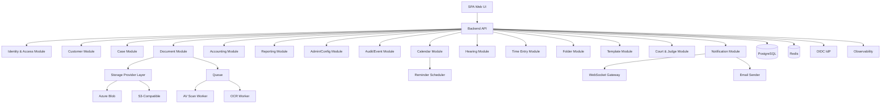
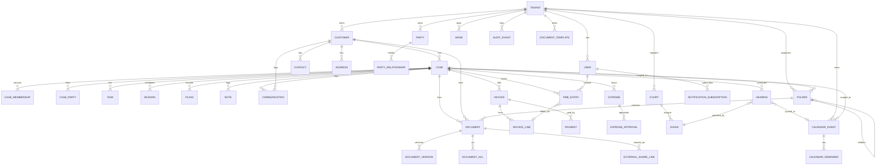

# Technical Design Document (TDD) / System Architecture
## Law Office Management Web Application (LOMA) — Phase 2

**Version:** 2.0  
**Date:** 2026-02-25  

---

## 1. Architectural Decisions (Final)

### 1.1 Architecture Style
- **Modular monolith** backend (MVP) with strict module boundaries:
  - Identity & Access
  - Customer
  - Case
  - Document
  - Accounting
  - Reporting
  - Admin & Configuration
  - Audit/Eventing
- Rationale:
  - Faster delivery and simpler operations for MVP
  - Keeps boundaries explicit for future service extraction

### 1.2 Tenancy
- **Schema-per-tenant** in PostgreSQL for all tenants in MVP.
- Enterprise dedicated DB deferred to later phases.

### 1.3 API Approach
- **REST** API with versioning: `/api/v1`
- Cursor-based pagination for high-volume lists
- Idempotency for finance writes (payments, optionally invoice create) via `Idempotency-Key`
- Concurrency control via rowVersion/ETag fields on mutable entities

### 1.4 Document Storage
- Binaries stored in object storage.
- Metadata + permissions stored in DB.
- Pre-signed upload URLs for direct client upload (MVP focus).
- Malware scanning gate blocks visibility until Passed.
- Immutable versions; explicit check-out/in; admin lock break.

### 1.5 Globalization
- EN + AR (RTL) required in MVP.
- Tenant timezone default; store UTC.

### 1.6 Calendar Library
- Backend uses **RRULE parser** (`rrule` npm) for recurring-event expansion.
- Frontend renders via **FullCalendar React** (`@fullcalendar/react`) with Day / Week / Month / Agenda views.
- Rationale: battle-tested OSS, RTL-ready, minimal custom rendering needed.

### 1.7 OCR Engine
- **Tesseract.js** (`tesseract.js` v5) with `ara` + `eng` language packs.
- Runs inside a BullMQ worker process to avoid blocking the API.
- Extracted text is stored in `document_version.ocr_text` and fed into `tsvector` column for full-text search.
- Rationale: no external service dependency; sufficient accuracy for legal documents; can be swapped for Azure AI Document Intelligence later.

### 1.8 OIDC Provider
- **Keycloak** (self-hosted) or **Microsoft Entra ID** (SaaS) as the OIDC Authorization Server.
- Authorization Code + PKCE flow for SPA; no implicit/hybrid.
- Backend validates JWT (`iss`, `aud`, `exp`, `tenant_id` custom claim).
- Refresh-token rotation enabled; access-token lifetime ≤ 15 min.
- MVP JWT-based dev login retained behind feature flag for local development only.

---

## 2. Logical Architecture



---

## 3. Deployment Architecture (Azure-ready, provider-agnostic)

**Compute**
- Web UI: static hosting + CDN
- API: containerized service (App Service / AKS / ECS equivalent)
- Worker: containerized service

**Data**
- PostgreSQL (managed service recommended)
- Object storage (Azure Blob / S3)
- Queue (Service Bus / Storage Queue / SQS equivalent)

**Secrets**
- Secret manager (Key Vault / Secrets Manager equivalent)

**Observability**
- Centralized logging, metrics, tracing

---

## 4. Data Architecture

### 4.1 Core Entities (High-level)
- Tenant, User, Role, CaseMembership
- Customer, Contact, Address
- Party, PartyRelationship, CaseParty
- Case, Task, Session, Filing, Note, Communication
- Document, DocumentVersion, DocumentAclEntry, LegalHold
- Invoice, InvoiceLineItem, Payment
- Expense, ExpenseApprovalStep, Wage
- AuditEvent, OutboxEvent

**Phase 2 Additions:**
- CalendarEvent, CalendarReminder, RecurrenceRule
- Court, Judge, Hearing
- Folder, DocumentTemplate
- TimeEntry
- NotificationSubscription
- ExternalShareLink

### 4.2 ERD (Mermaid)


### 4.3 Indexing and Constraints (minimum)
- Unique constraints per tenant:
  - customer.taxId, customer.registrationId, customer.nationalId, customer.passportNumber (nullable unique)
- Case references:
  - case.systemCaseRef unique per tenant
  - invoice.invoiceNumber unique per tenant
- Document:
  - documentVersion checksum indexed for integrity checks (optional)
- Search:
  - Trigram indexes on names/title fields (optional) for fast partial matches

---

## 5. Storage Provider Abstraction

### 5.1 Interface
`IStorageProvider`:
- `CreateUploadUrl(objectKey, contentType, checksum, size, ttlMinutes) -> signedUrl + requiredHeaders`
- `CreateDownloadUrl(objectKey, ttlMinutes) -> signedUrl`
- `GetObjectMetadata(objectKey) -> size, etag, lastModified` (optional)
- `DeleteObject(objectKey)` (used by purge jobs)

### 5.2 Tenant Storage Configuration
- Mode: Shared | Dedicated
- ProviderType: AzureBlob | S3Compatible
- Settings:
  - container/bucket, endpoint/region, basePrefix
  - credentials reference in secret manager

### 5.3 Hierarchical Path Strategy
Object keys follow a hierarchical convention inside each tenant’s base prefix:

```
{basePrefix}/{tenantId}/documents/{folderId|_root}/{documentId}/{versionId}/{filename}
{basePrefix}/{tenantId}/templates/{templateId}/{filename}
{basePrefix}/{tenantId}/exports/{reportId}/{filename}
```

- Folder moves update DB foreign keys; **object keys are immutable** (no storage-level rename).
- Listing operations use DB queries, never provider `list-objects`.

### 5.4 Azure Blob Provider
- Implements `IStorageProvider` using `@azure/storage-blob` SDK.
- Uses **SAS tokens** (service-level) for upload/download URLs; account-level SAS prohibited.
- Container access level: **Private** (no anonymous access).
- Lifecycle management policy: move to Cool tier after 90 days, Archive after 365 days.
- Soft-delete enabled (14-day retention) for accidental deletion recovery.

---

## 6. Document Scanning Pipeline

### 6.1 States
- Pending: hidden
- Passed: visible
- Failed: quarantined

### 6.2 Flow
1. API issues upload URL, creates pending version
2. Storage emits event (or polling) → queue message
3. Worker pulls object, scans, updates status
4. On Passed: mark currentVersionId = latest passed
5. On Failed: quarantine and block downloads

### 6.3 OCR Worker (Phase 2)
1. Triggered after AV scan **Passed** for eligible MIME types (`application/pdf`, `image/*`).
2. BullMQ job picks the object key, downloads to temp storage.
3. **Tesseract.js** processes each page with `ara` + `eng` language packs.
4. Extracted text concatenated and stored in `document_version.ocr_text`.
5. `tsvector` column (`document_version.search_vector`) updated via PostgreSQL trigger.
6. Job status tracked: `Queued → Processing → Completed | Failed`.
7. On failure: retry 2× with exponential back-off; after final failure mark `ocr_status = Failed` (document remains accessible; OCR is best-effort).
8. OCR latency target: ≤ 30 s per 10-page PDF.

---

## 7. Security Architecture

### 7.1 AuthN
- OIDC Authorization Code + PKCE
- JWT validation and claims mapping

### 7.2 AuthZ (RBAC + ABAC)
- RBAC: role permissions
- ABAC:
  - tenant match
  - case membership
  - document ACL and confidentiality

### 7.3 Step-up Re-auth
- Use IdP re-auth prompt (max_age) for sensitive actions.
- Record audit events for step-up.

### 7.4 Audit Logging
- Append-only `audit_events`
- Include: eventType, actorUserId, tenantId, entityType, entityId, payload (minimal), timestamp, correlationId

### 7.5 Threat Model Highlights
- Broken object-level authorization → centralized checks + tests
- Signed URL leakage → short TTL + server-side issuance only
- Malware uploads → scan gate + quarantine
- Privilege escalation → least privilege + audit + step-up
- Export exfiltration → permission gating + audit + rate limiting

### 7.6 OIDC Authentication Flow (Phase 2)
1. SPA redirects to IdP `/authorize` with `response_type=code`, PKCE `code_challenge`.
2. User authenticates; IdP redirects back with `code`.
3. SPA exchanges `code` + `code_verifier` for tokens at IdP `/token`.
4. Backend validates JWT signature (JWKS), `iss`, `aud`, `exp`, `tenant_id` claim.
5. Refresh tokens stored in HTTP-only secure cookie; access tokens kept in memory.
6. Step-up re-auth uses `max_age=0` + `acr_values=step-up`.
7. Logout: revoke refresh token at IdP + clear local session.

### 7.7 Phase 2 RBAC Extensions

| Permission | Lawyer | Accountant | TenantAdmin | SystemAdmin |
|---|---|---|---|---|
| calendar.create / .update / .delete own | ✓ | ✓ | ✓ | ✓ |
| calendar.update / .delete any (tenant) | | | ✓ | ✓ |
| hearing.create / .update | ✓ | | ✓ | ✓ |
| hearing.cancel | | | ✓ | ✓ |
| folder.create / .update / .delete | ✓ | | ✓ | ✓ |
| template.manage | | | ✓ | ✓ |
| time_entry.create / .update / .delete own | ✓ | ✓ | ✓ | |
| time_entry.approve | | ✓ | ✓ | |
| court.manage / judge.manage | | | ✓ | ✓ |
| external_share.create / .revoke | ✓ | | ✓ | ✓ |
| notification.manage_own | ✓ | ✓ | ✓ | ✓ |

### 7.8 Folder Permission Inheritance
- Each `Folder` may define an optional ACL override; otherwise inherits from parent folder.
- Root-level folders inherit from the **Case** `CaseMembership` permissions.
- Permission evaluation order: Folder ACL → Parent Folder ACL → … → Case Membership.
- Admin override: TenantAdmin and SystemAdmin bypass folder ACL.
- Confidentiality level on documents inside folders still applies (highest restriction wins).

---

## 8. API Specification (MVP)

**Conventions**
- All endpoints under `/api/v1`
- Pagination: `?cursor=...&limit=...`
- Idempotency: header `Idempotency-Key` required for POST /payments (and optionally /expenses submit)

### 8.1 Customers
- `POST /customers`
- `GET /customers?cursor&limit&query&filters`
- `GET /customers/{customerId}`
- `PATCH /customers/{customerId}`
- `POST /customers/{customerId}/contacts`
- `PATCH /customers/{customerId}/contacts/{contactId}`
- `POST /customers/{customerId}/documents` (redirects to Document flow; metadata scope=customer)
- `GET /customers/{customerId}/financial-summary`
- `GET /customers/{customerId}/compliance-checklist`

### 8.2 Cases
- `POST /cases`
- `GET /cases?...filters`
- `GET /cases/{caseId}`
- `POST /cases/{caseId}/transition`
- `POST /cases/{caseId}/on-hold` / `DELETE /cases/{caseId}/on-hold`
- `POST /cases/{caseId}/reopen`
- `GET /cases/{caseId}/completeness`
- `POST /cases/{caseId}/memberships`
- `PATCH /cases/{caseId}/memberships/{membershipId}`
- `POST /cases/{caseId}/tasks`
- `PATCH /cases/{caseId}/tasks/{taskId}`
- `POST /cases/{caseId}/sessions`
- `PATCH /cases/{caseId}/sessions/{sessionId}`
- `POST /cases/{caseId}/sessions/{sessionId}/reschedule`
- `POST /cases/{caseId}/filings`
- `PATCH /cases/{caseId}/filings/{filingId}`
- `POST /cases/{caseId}/notes` (append-only)
- `POST /cases/{caseId}/communications`
- `POST /cases/{caseId}/parties` (CaseParty links)

### 8.3 Documents
- `POST /documents` (create metadata + pending version + upload URL)
- `POST /documents/{docId}/versions` (requires checkout if policy enabled)
- `GET /documents?scope=case|customer&scopeId=...`
- `GET /documents/{docId}`
- `POST /documents/{docId}/checkout`
- `POST /documents/{docId}/checkin` (or implicit after version upload)
- `POST /documents/{docId}/break-lock` (admin; step-up)
- `GET /documents/{docId}/versions/{versionId}/download-url`
- `POST /documents/{docId}/shares`
- `DELETE /documents/{docId}/shares/{shareId}`
- `POST /documents/{docId}/legal-hold`
- `DELETE /documents/{docId}/legal-hold`
- `DELETE /documents/{docId}` (soft delete)
- `POST /documents/{docId}/restore`

### 8.4 Accounting
- `POST /invoices`
- `PATCH /invoices/{invoiceId}` (draft only)
- `POST /invoices/{invoiceId}/finalize` (accountant)
- `POST /invoices/{invoiceId}/mark-sent`
- `POST /invoices/{invoiceId}/void` (accountant or tenant admin)
- `GET /invoices?...filters`
- `GET /invoices/{invoiceId}`
- `POST /payments` (idempotent; single invoice)
- `GET /payments?...filters`
- `POST /expenses`
- `POST /expenses/{expenseId}/submit`
- `POST /expenses/{expenseId}/approve` (multi-step)
- `POST /expenses/{expenseId}/reject`
- `GET /reports/...` (CSV export endpoints)

### 8.5 Admin
- `POST /admin/users`
- `PATCH /admin/users/{userId}` (deactivate/reactivate, roles)
- `GET /admin/master-data/...` (CRUD per list)
- `POST /admin/expense-approval-workflow`
- `GET /admin/tiers` / `PATCH /admin/tiers`

### 8.6 Calendar (Phase 2)
- `POST /calendar/events`
- `GET /calendar/events?start&end&caseId&type&view`
- `GET /calendar/events/{eventId}`
- `PATCH /calendar/events/{eventId}`
- `DELETE /calendar/events/{eventId}`
- `POST /calendar/events/{eventId}/reminders`
- `DELETE /calendar/events/{eventId}/reminders/{reminderId}`
- `GET /calendar/events/conflicts?start&end` (conflict check)

### 8.7 Hearings (Phase 2)
- `POST /cases/{caseId}/hearings`
- `GET /cases/{caseId}/hearings`
- `GET /hearings/{hearingId}`
- `PATCH /hearings/{hearingId}`
- `POST /hearings/{hearingId}/transition` (Scheduled → InProgress → Completed | Adjourned | Cancelled)
- `POST /hearings/{hearingId}/reschedule`
- `GET /hearings/{hearingId}/history`

### 8.8 Folders (Phase 2)
- `POST /folders` (scope = case | customer | tenant-library)
- `GET /folders?scopeType&scopeId&parentId`
- `GET /folders/{folderId}`
- `PATCH /folders/{folderId}`
- `DELETE /folders/{folderId}` (soft; must be empty or recursive archive)
- `POST /folders/{folderId}/move` (change parentId)

### 8.9 Document Templates (Phase 2)
- `POST /templates`
- `GET /templates?category&folderId`
- `GET /templates/{templateId}`
- `PATCH /templates/{templateId}`
- `DELETE /templates/{templateId}`
- `POST /templates/{templateId}/preview` (render with sample data)
- `POST /templates/{templateId}/generate` (render + auto-upload to folder)

### 8.10 Time Entries (Phase 2)
- `POST /time-entries`
- `GET /time-entries?userId&caseId&status&dateFrom&dateTo`
- `GET /time-entries/{timeEntryId}`
- `PATCH /time-entries/{timeEntryId}` (Draft only)
- `DELETE /time-entries/{timeEntryId}` (Draft only)
- `POST /time-entries/{timeEntryId}/submit`
- `POST /time-entries/bulk-approve` (body: `{ ids: [...] }`)
- `POST /time-entries/{timeEntryId}/reject`
- `POST /time-entries/{timeEntryId}/write-off`
- `GET /time-entries/weekly-summary?userId&weekStart`

### 8.11 Courts & Judges (Phase 2)
- `POST /courts`
- `GET /courts`
- `GET /courts/{courtId}`
- `PATCH /courts/{courtId}`
- `POST /courts/{courtId}/judges`
- `GET /courts/{courtId}/judges`
- `PATCH /judges/{judgeId}`
- `POST /judges/{judgeId}/deactivate`

### 8.12 External Sharing (Phase 2)
- `POST /documents/{docId}/shares`
- `GET /documents/{docId}/shares`
- `DELETE /documents/{docId}/shares/{shareId}`
- `GET /shared/{token}` (public download; validates expiry + password)

---

## 9. Operations

### 9.1 Environments
- Dev / Test / Prod isolation (network, storage, DB, secrets)

### 9.2 Backup & Restore
- DB PITR + daily snapshots
- Storage soft delete + versioning
- Restore tested in Test and documented

### 9.3 Monitoring & Alerts
- Metrics:
  - API latency/error rate
  - auth failures
  - queue depth
  - scan failure rate
  - DB CPU/storage
- Alerts on thresholds

### 9.4 DR
- MVP single-region; multi-region replication deferred.

### 9.5 OCR Worker (Phase 2)
- Dedicated BullMQ worker process consuming `ocr` queue.
- Horizontal scaling: multiple replicas (stateless); concurrency configurable per instance.
- Health check: `/healthz` on worker HTTP port.
- Metrics: `ocr_jobs_processed_total`, `ocr_job_duration_seconds`, `ocr_queue_depth`.

### 9.6 Reminder Scheduler (Phase 2)
- CronJob runs every minute; queries `calendar_reminder` where `remind_at ≤ NOW()` and `sent = false`.
- Dispatches notifications via Notification Module (WebSocket + Email).
- Marks `sent = true` after successful dispatch.
- Idempotency: unique constraint `(calendar_event_id, offset_minutes)` prevents duplicate reminders.

### 9.7 Notification Service (Phase 2)
- **WebSocket Gateway** (Socket.IO adapter on Redis) for real-time in-app notifications.
- **Email Sender** (SMTP / SendGrid) for email notifications and external share links.
- Users manage subscriptions (`NotificationSubscription` entity) to opt in/out per event type.
- Delivery SLA: in-app ≤ 2 s; email ≤ 60 s.
- Dead-letter queue for failed email deliveries; retry 3× with exponential back-off.

