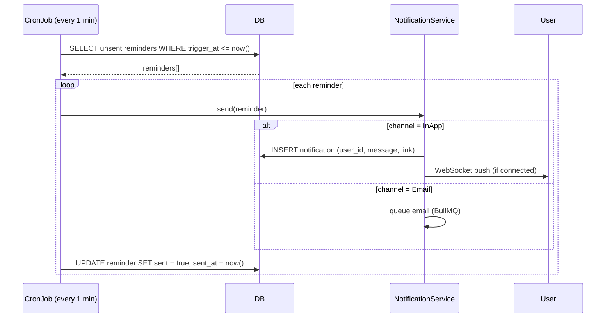

# Calendar Module Specification
## Law Office Management Application (LOMA) — Phase 2

**Date:** 2026-02-25  
**Baseline:** Phase 1 Session/Task entities (FSD §2, SRS FR-CASE)  
**Drivers:** D2 — No Calendar Module; D1 — Weak Data Model  
**Depends on:** PHASE2_DOMAIN_MODEL_AND_WORKFLOWS.md (CalendarEvent, CalendarReminder, Hearing entities)

---

## 1. Overview

Phase 1 has no calendar UI or module. Sessions and tasks have date fields but no unified calendar view, no conflict detection, and no reminders. Phase 2 introduces a **full calendar module** with day/week/month/agenda views, **event type unification** (hearing, session, task deadline, custom), **conflict detection**, **reminders**, **recurring events**, and **timezone/i18n support** for EN/AR.

---

## 2. Feature Inventory

| # | Feature | Source | Priority |
|---|---|---|---|
| F-CAL-01 | Day / Week / Month / Agenda views | D2, Wireframes §2.5 | P0 |
| F-CAL-02 | Event type unification (Hearing, Session, TaskDeadline, Custom) | D2, Domain Model | P0 |
| F-CAL-03 | Create/edit/delete events from calendar | D2 | P0 |
| F-CAL-04 | Conflict detection (overlapping events per attendee) | D2 | P0 |
| F-CAL-05 | Event coloring by type | UX feedback | P0 |
| F-CAL-06 | Quick-create from clicking empty slot | UX feedback | P1 |
| F-CAL-07 | Recurring events (daily, weekly, monthly) | D2 | P1 |
| F-CAL-08 | In-app reminders | D2 | P1 |
| F-CAL-09 | Email reminders | D2 | P2 |
| F-CAL-10 | Drag-and-drop event rescheduling | UX feedback | P1 |
| F-CAL-11 | Case-filtered calendar view | D2 | P1 |
| F-CAL-12 | Print / export calendar (PDF) | UX feedback | P2 |
| F-CAL-13 | Timezone support (per tenant) | SRS NFR-G18N | P1 |
| F-CAL-14 | RTL calendar layout for Arabic | Style Guide §2 | P0 |

---

## 3. Data Model Reference

Full entity definitions in `PHASE2_DOMAIN_MODEL_AND_WORKFLOWS.md §2`:
- **CalendarEvent** — unified event with type discriminator
- **CalendarReminder** — notification trigger linked to event
- **CalendarEventAttendee** — RSVP tracking per attendee

### 3.1 Event Type Semantics

| Type | Source Entity | Auto-created | Editable Fields | Delete Behavior |
|---|---|---|---|---|
| **Hearing** | Hearing | Yes, on hearing create | Read-only (edit via hearing) | Cascade from hearing |
| **Session** | Session | Yes, on session create | Read-only (edit via session) | Cascade from session |
| **TaskDeadline** | Task | Yes, on task create/update | Read-only due date (edit via task) | Cascade from task |
| **Custom** | — | No, user-created | All fields | Direct delete |
| **Reminder** | — | No, user-created | All fields | Direct delete |

### 3.2 Recurring Events

**Recurrence Rule:** Simplified iCalendar RRULE subset stored as `recurrence_rule`:

```
FREQ=WEEKLY;BYDAY=MO,WE,FR;UNTIL=20261231
FREQ=MONTHLY;BYMONTHDAY=15;COUNT=12
```

**Instance Generation:**
- Instances generated on-demand when querying date range (not pre-materialized)
- Modifications to single instance: create exception record (`calendar_event_exception`)
- Deletion of single instance: create exclusion record
- Deletion of series: soft-delete parent + all exceptions

---

## 4. API Specification

### 4.1 Calendar Endpoints

| Endpoint | Method | Auth | Description |
|---|---|---|---|
| `/api/v2/calendar/events` | GET | Authenticated | List events in date range |
| `/api/v2/calendar/events` | POST | Authenticated | Create custom event |
| `/api/v2/calendar/events/{id}` | GET | Event attendee or creator | Get event detail |
| `/api/v2/calendar/events/{id}` | PATCH | Event creator or TenantAdmin | Update event |
| `/api/v2/calendar/events/{id}` | DELETE | Event creator or TenantAdmin | Cancel/delete event |
| `/api/v2/calendar/events/{id}/rsvp` | POST | Attendee | Update RSVP status |
| `/api/v2/calendar/conflicts` | POST | Authenticated | Check conflicts for time range |
| `/api/v2/calendar/export` | GET | Authenticated | Export as PDF |

### 4.2 Query Parameters for GET `/events`

| Param | Type | Required | Description |
|---|---|---|---|
| `from` | ISO datetime | Yes | Range start (inclusive) |
| `to` | ISO datetime | Yes | Range end (exclusive) |
| `userId` | UUID | No | Filter by attendee (default: current user) |
| `caseId` | UUID | No | Filter by case |
| `eventType` | enum | No | Filter by type |
| `includeRecurring` | boolean | No | Expand recurring instances (default: true) |

### 4.3 Create Event DTO

```typescript
interface CreateCalendarEventDto {
  title: string;                          // required, max 200 chars
  description?: string;                   // max 2000 chars
  startAt: string;                        // ISO 8601 datetime
  endAt: string;                          // ISO 8601, must be after startAt
  allDay?: boolean;                       // default false
  eventType: 'Custom' | 'Reminder';       // Hearing/Session/TaskDeadline auto-created
  caseId?: string;                        // optional case association
  location?: string;                      // max 500 chars
  attendeeUserIds?: string[];             // user IDs to invite
  recurrence?: 'None' | 'Daily' | 'Weekly' | 'Monthly';
  recurrenceRule?: string;                // RRULE string
  reminders?: { minutesBefore: number; channel: 'InApp' | 'Email' }[];
}
```

### 4.4 Conflict Detection

```
POST /api/v2/calendar/conflicts
Body: { startAt, endAt, attendeeUserIds[], excludeEventId? }
Response: { hasConflict: boolean, conflicts: CalendarEvent[] }
```

Conflict = any existing event where:
- Same attendee overlaps `[startAt, endAt)` range
- Event is not cancelled
- `excludeEventId` is ignored (for updates)

Conflict is **non-blocking** (warning, not error) — lawyers may have double-booked hearings.

---

## 5. Calendar Views

### 5.1 View Specifications

| View | Time Granularity | Slot Height | Features |
|---|---|---|---|
| **Day** | 30-min slots, 7:00–21:00 default | 48px per slot | Full event detail, drag-resize |
| **Week** | 30-min slots, 7:00–21:00 | 24px per slot | Event blocks, overflow "+N more" |
| **Month** | Day cells | Auto | Dot/chip indicators, click to expand day |
| **Agenda** | Chronological list | N/A | Grouped by date, full detail, infinit scroll |

### 5.2 Event Color Coding

| Event Type | Color Token | Hex |
|---|---|---|
| Hearing | `calendar.hearing` | `#D32F2F` (red-700) |
| Session | `calendar.session` | `#1976D2` (blue-700) |
| TaskDeadline | `calendar.deadline` | `#F57C00` (orange-700) |
| Custom | `calendar.custom` | `#388E3C` (green-700) |
| Reminder | `calendar.reminder` | `#7B1FA2` (purple-700) |
| Cancelled | `calendar.cancelled` | `#9E9E9E` (grey) with strikethrough |

### 5.3 RTL Layout

- Calendar headers and navigation mirrored for Arabic
- Week starts on Sunday (configurable per tenant: Sunday or Monday)
- Day view: time column on right in RTL mode
- All text direction handled by MUI + `dir="rtl"` attribute
- Date formatting: `Intl.DateTimeFormat` with tenant locale

### 5.4 Interaction Patterns

| Interaction | Behavior |
|---|---|
| Click empty slot | Opens quick-create popover (title, type, time pre-filled) |
| Click event | Opens event detail drawer (right side / left in RTL) |
| Drag event | Reschedule (PATCH startAt/endAt) with conflict check |
| Drag event edge | Resize duration |
| Keyboard `N` | New event dialog |
| Keyboard `T` | Jump to today |
| Keyboard `←` / `→` | Previous / next period |
| Keyboard `1/2/3/4` | Switch Day/Week/Month/Agenda |

---

## 6. Reminders & Notifications

### 6.1 Reminder Processing



### 6.2 Default Reminders

| Event Type | Default Reminders |
|---|---|
| Hearing | 1 day before (Email+InApp), 1 hour before (InApp) |
| Session | 30 min before (InApp) |
| TaskDeadline | 1 day before (InApp) |
| Custom | User-configured |

Users can override defaults per event.

### 6.3 Notification UI

- Bell icon in global nav header shows unread count badge
- Dropdown: list of recent notifications, grouped by date
- Click notification → navigates to event/case/hearing
- Mark as read (individual or all)
- Notification preferences per event type (NotificationSubscription entity)

---

## 7. Case-Filtered Calendar

### 7.1 Behavior

When viewing a case, the **Case Calendar** tab shows only events linked to that case:
- Hearings for this case
- Sessions for this case
- Task deadlines for this case
- Custom events tagged to this case

### 7.2 Mini Calendar Widget

The case detail page sidebar includes a **mini month calendar** showing:
- Dots on dates with events
- Click date → scrolls agenda to that date
- Hearing dates highlighted in red

---

## 8. Integration Points

### 8.1 Hearing → Calendar

- `HearingService.createHearing()` → calls `CalendarService.createEvent()` automatically
- `HearingService.postponeHearing()` → cancels old CalendarEvent, creates new one
- `HearingService.completeHearing()` → marks CalendarEvent as Completed
- CalendarEvent for hearing is **read-only** in calendar UI; edits go through hearing management

### 8.2 Session → Calendar

- `SessionService.createSession()` → calls `CalendarService.createEvent()` automatically
- Session rescheduling updates CalendarEvent
- CalendarEvent for session is **read-only** in calendar UI

### 8.3 Task → Calendar

- `TaskService.createTask()` with due date → calls `CalendarService.createEvent(type: TaskDeadline)`
- Task due date update → updates CalendarEvent
- Task completion → marks CalendarEvent as Completed

---

## 9. Frontend Component Architecture

```
CalendarModule/
├── CalendarPage.tsx              # Route: /calendar
├── components/
│   ├── CalendarHeader.tsx        # Navigation, view switcher, filters
│   ├── DayView.tsx               # Day grid with time slots
│   ├── WeekView.tsx              # Week grid
│   ├── MonthView.tsx             # Month grid
│   ├── AgendaView.tsx            # Chronological list
│   ├── EventChip.tsx             # Color-coded event block
│   ├── EventDetailDrawer.tsx     # Side panel for event details
│   ├── QuickCreatePopover.tsx    # Inline event creation
│   ├── EventFormDialog.tsx       # Full create/edit dialog
│   ├── ConflictWarning.tsx       # Conflict notification banner
│   ├── MiniCalendar.tsx          # Sidebar mini month (for case view)
│   └── NotificationBell.tsx      # Global nav notification icon
├── hooks/
│   ├── useCalendarEvents.ts      # React Query hook for events
│   ├── useConflictCheck.ts       # Conflict detection hook
│   └── useReminders.ts           # WebSocket reminder listener
└── utils/
    ├── recurrence.ts             # RRULE parsing and instance generation
    ├── dateUtils.ts              # Timezone, locale, formatting
    └── calendarColors.ts         # Event type color map
```

---

## 10. Non-Functional Requirements

| Requirement | Target | Notes |
|---|---|---|
| Event query latency | < 200ms for month view (95th percentile) | Composite index on `(tenant_id, start_at, end_at)` |
| Concurrent calendar users | 50 per tenant | WebSocket connection pool |
| Recurring event expansion | Max 365 instances per query | Client-side expansion for display |
| Reminder delivery | Within 60s of trigger time | CronJob every 1 min |
| Calendar render (FCP) | < 1.5s | Lazy-load non-visible views |
| RTL layout correctness | 100% for all views | Automated visual regression tests |
| Timezone consistency | All times stored as UTC, displayed in tenant TZ | `Intl.DateTimeFormat` |
| Max events per day display | 50 before "show more" | UX safeguard |
