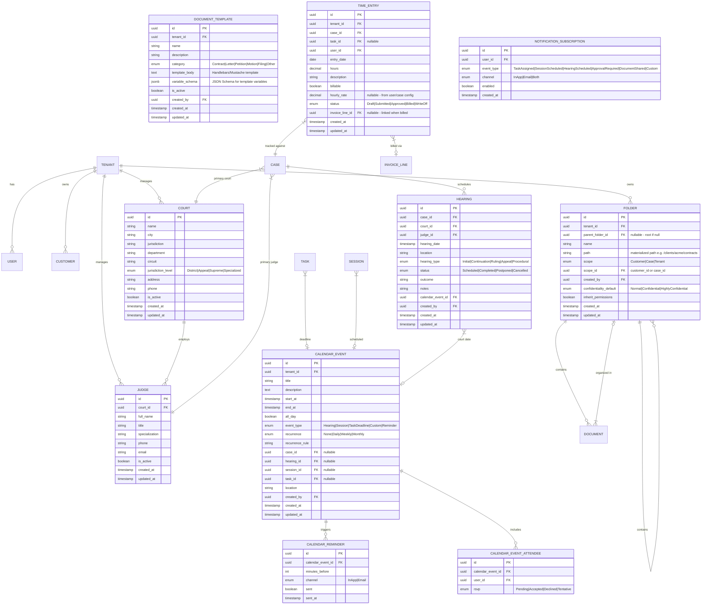
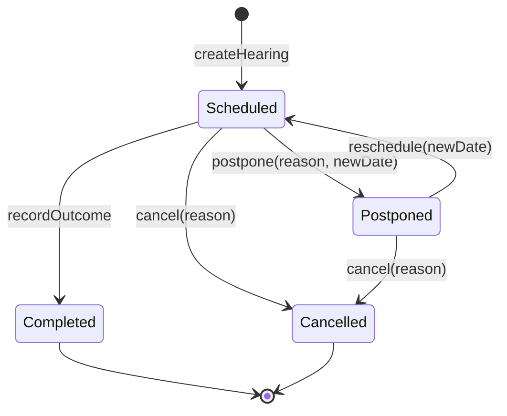
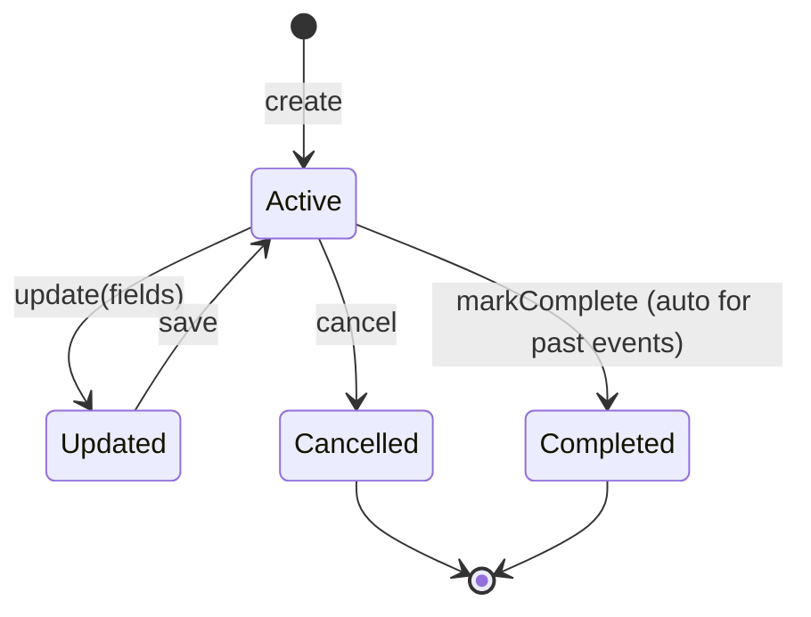
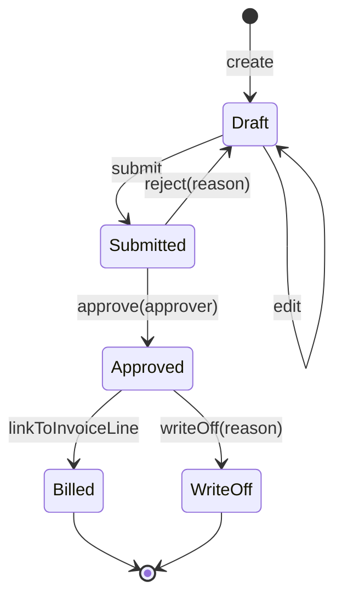
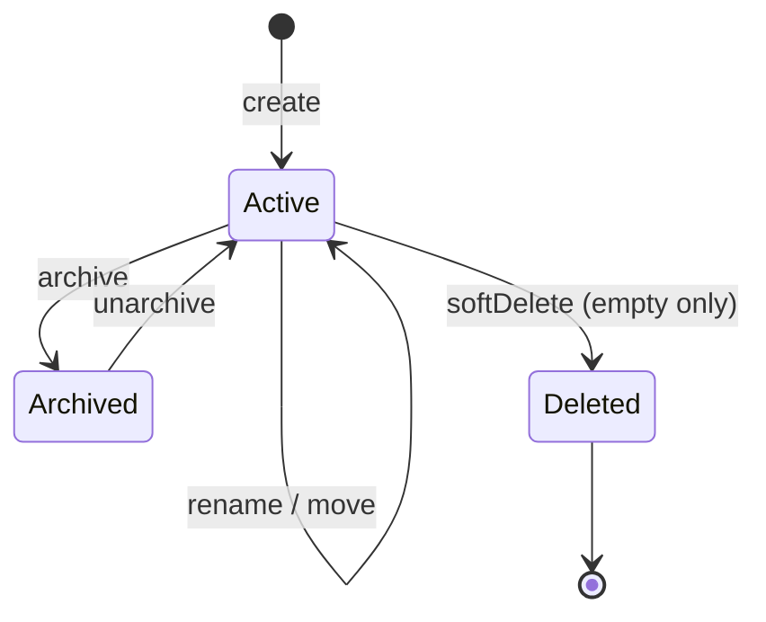
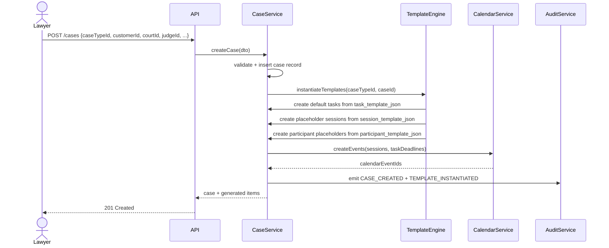
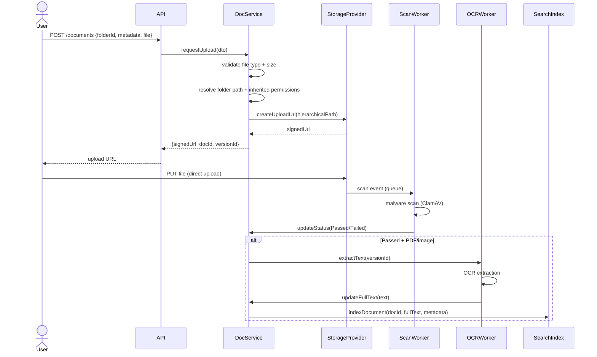
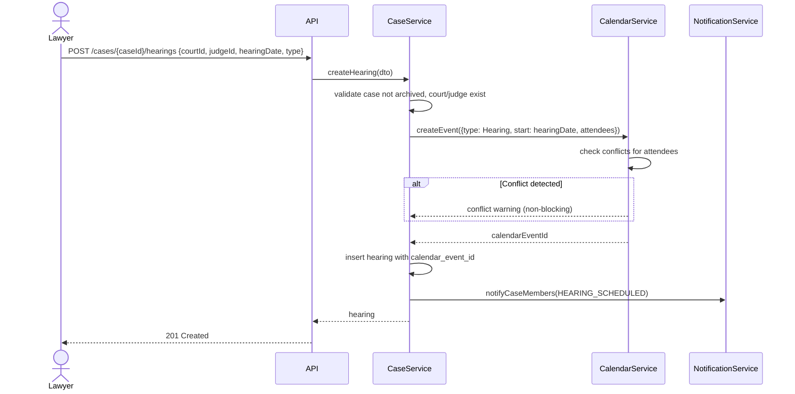
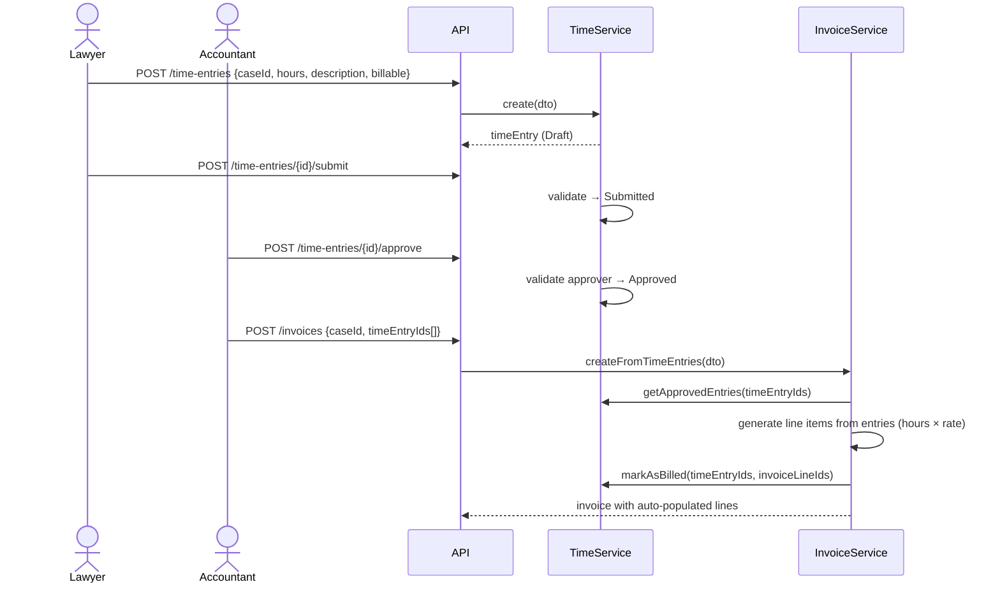

# Phase 2 Domain Model & Workflows
## Law Office Management Application (LOMA)

**Date:** 2026-02-25  
**Baseline:** PHASE1_BASELINE_SUMMARY.md, Phase 1 ERD (TDD §4.2)  
**Scope:** New entities, extended entities, relationships, state machines, and workflow definitions for Phase 2

---

## 1. Entity Inventory

### 1.1 New Entities (Phase 2)

| Entity | Module | Description |
|---|---|---|
| **Judge** | Admin/Case | Court-affiliated judge with contact details and specializations |
| **Hearing** | Case/Calendar | Court hearing with date, court, judge, case, parties, outcome |
| **CalendarEvent** | Calendar | Unified calendar entry (hearing, session, task deadline, custom) |
| **CalendarReminder** | Calendar | Scheduled reminder linked to CalendarEvent |
| **Folder** | Document | Hierarchical folder within a document library |
| **DocumentTemplate** | Document | Reusable template for document generation |
| **TimeEntry** | Accounting | Billable/non-billable time record linked to case/task |
| **NotificationSubscription** | Notification | User subscription preferences for event types |

### 1.2 Extended Entities (Phase 2 Modifications)

| Entity | Changes |
|---|---|
| **Court** | Add: `department`, `circuit`, `jurisdiction_level` (enum), `is_active` flag, `judge_ids[]` relationship |
| **Session** | Add: `calendar_event_id` FK, deprecate standalone scheduling fields |
| **Task** | Add: `calendar_event_id` FK for deadline on calendar, `estimated_hours` |
| **Document** | Add: `folder_id` FK (nullable for root-level docs), `full_text_content` (extracted), `ocr_status` |
| **DocumentVersion** | Add: `checksum_sha256`, `storage_provider` enum |
| **Case** | Add: `primary_court_id` FK, `primary_judge_id` FK |
| **CaseType** | Add: `task_template_json`, `session_template_json`, `participant_template_json` (instantiated on create) |
| **Invoice** | Add: generated `time_entry_ids[]` for auto-populated line items |
| **Note** | Remove append-only constraint; add `updated_at`, `updated_by`, `edit_history_json` |
| **User** | Add: `oidc_subject`, `oidc_issuer` for OIDC mapping |

---

## 2. Phase 2 ERD

---

## 3. State Machines

### 3.1 Hearing State Machine

**Rules:**
- Hearing creation requires `case_id`, `court_id`, `hearing_date`; `judge_id` recommended
- Postpone creates a new CalendarEvent for the new date; original event marked Cancelled
- Completed requires `outcome` text
- All transitions audited: `HEARING_CREATED`, `HEARING_COMPLETED`, `HEARING_POSTPONED`, `HEARING_CANCELLED`

### 3.2 CalendarEvent Lifecycle

**Rules:**
- Events linked to Hearing/Session inherit state from parent entity
- Standalone (Custom) events are managed independently
- Recurring events generate instances; modifications to a single instance create an exception
- Conflict detection runs on create/update: `overlapping(start_at, end_at, attendee_user_ids)` returns boolean

### 3.3 TimeEntry State Machine

**Rules:**
- Lawyer creates time entries (own entries only in MVP)
- TenantAdmin or designated approver approves
- Approved entries can be linked to invoice line items (auto-populate)
- Billed entries are immutable
- WriteOff requires reason and audit

### 3.4 Folder Lifecycle

**Rules:**
- Folders inherit confidentiality_default to new child documents (overridable)
- `inherit_permissions = true` → child docs inherit folder ACL
- Move folder updates materialized path for all descendants
- Cannot soft-delete folder with documents (must be empty)
- Archive makes folder and contents read-only (like case archiving)

---

## 4. Workflows

### 4.1 Case Creation with Template Instantiation

### 4.2 Document Upload to Folder with OCR

### 4.3 Hearing Scheduling with Calendar

### 4.4 Time Entry to Invoice Flow

---

## 5. RBAC Extensions

### 5.1 New Permissions Matrix

| Action | Lawyer | Accountant | TenantAdmin | SystemAdmin |
|---|---|---|---|---|
| **Court** CRUD | Read | — | Full | Read |
| **Judge** CRUD | Read | — | Full | Read |
| **Hearing** Create/Update | ✅ (own cases) | — | ✅ | — |
| **Hearing** Read | ✅ (case member) | ✅ (FinanceAllowed) | ✅ | — |
| **Calendar** View own | ✅ | ✅ | ✅ | — |
| **Calendar** View all | — | — | ✅ | — |
| **Calendar** Custom event CRUD | ✅ (own) | ✅ (own) | ✅ | — |
| **Folder** Create/Rename/Move | ✅ (case/customer scope) | — | ✅ | — |
| **Folder** Delete (empty) | — | — | ✅ | — |
| **Folder** Archive | — | — | ✅ | — |
| **Document Template** CRUD | — | — | ✅ | — |
| **Document Template** Use | ✅ | — | ✅ | — |
| **Time Entry** Create/Edit own | ✅ | — | — | — |
| **Time Entry** Submit | ✅ (own) | — | — | — |
| **Time Entry** Approve | — | ✅ | ✅ | — |
| **Time Entry** Read (case) | ✅ (case member) | ✅ | ✅ | — |
| **Invoice from Time** | — | ✅ | ✅ | — |
| **Numbering Scheme** Config | — | — | ✅ | ✅ |
| **OIDC Tenant Config** | — | — | — | ✅ |

### 5.2 ABAC Extensions

| Rule | Enforcement Point | Phase 1 Status | Phase 2 Change |
|---|---|---|---|
| Case membership on READ | CaseService.getById, CaseController.* | ⚠️ Write-only | Enforce on all GETs |
| visibilityScope on participant | CaseService.get*, financial endpoints | ⚠️ Schema only | Wire into authorization |
| Folder permission inheritance | DocumentService.getById, folder endpoints | N/A | New — folder ACL inherits to docs |
| Time entry ownership | TimeEntryService.* | N/A | New — Lawyer edits own entries only |
| Calendar event visibility | CalendarService.getEvents | N/A | New — user sees own events + case events for membered cases |

---

## 6. Audit Event Catalog (Phase 2 Additions)

| Event Type | Entity | Trigger |
|---|---|---|
| JUDGE_CREATED | Judge | Admin creates judge |
| JUDGE_UPDATED | Judge | Admin updates judge |
| HEARING_CREATED | Hearing | Lawyer/Admin creates hearing |
| HEARING_COMPLETED | Hearing | Outcome recorded |
| HEARING_POSTPONED | Hearing | Hearing postponed with reason |
| HEARING_CANCELLED | Hearing | Hearing cancelled |
| CALENDAR_EVENT_CREATED | CalendarEvent | Any event created |
| CALENDAR_EVENT_UPDATED | CalendarEvent | Event modified |
| CALENDAR_EVENT_CANCELLED | CalendarEvent | Event cancelled |
| FOLDER_CREATED | Folder | User creates folder |
| FOLDER_RENAMED | Folder | User renames folder |
| FOLDER_MOVED | Folder | User moves folder |
| FOLDER_ARCHIVED | Folder | Admin archives folder |
| FOLDER_DELETED | Folder | Admin deletes empty folder |
| DOCUMENT_GENERATED | Document | Document generated from template |
| TEMPLATE_CREATED | DocumentTemplate | Admin creates template |
| TEMPLATE_UPDATED | DocumentTemplate | Admin updates template |
| TEMPLATE_INSTANTIATED | CaseType | Templates instantiated on case create |
| TIME_ENTRY_CREATED | TimeEntry | Lawyer creates entry |
| TIME_ENTRY_SUBMITTED | TimeEntry | Lawyer submits entry |
| TIME_ENTRY_APPROVED | TimeEntry | Approver approves entry |
| TIME_ENTRY_REJECTED | TimeEntry | Approver rejects entry |
| TIME_ENTRY_BILLED | TimeEntry | Entry linked to invoice |
| TIME_ENTRY_WRITTEN_OFF | TimeEntry | Entry written off |
| NOTE_EDITED | Note | User edits note (was append-only) |
| OIDC_CONFIG_UPDATED | Tenant | OIDC configuration changed |
| NUMBERING_SCHEME_UPDATED | Tenant | Numbering format changed |
| EXTERNAL_SHARE_CREATED | Document | External sharing link created |
| EXTERNAL_SHARE_REVOKED | Document | External sharing link revoked |
