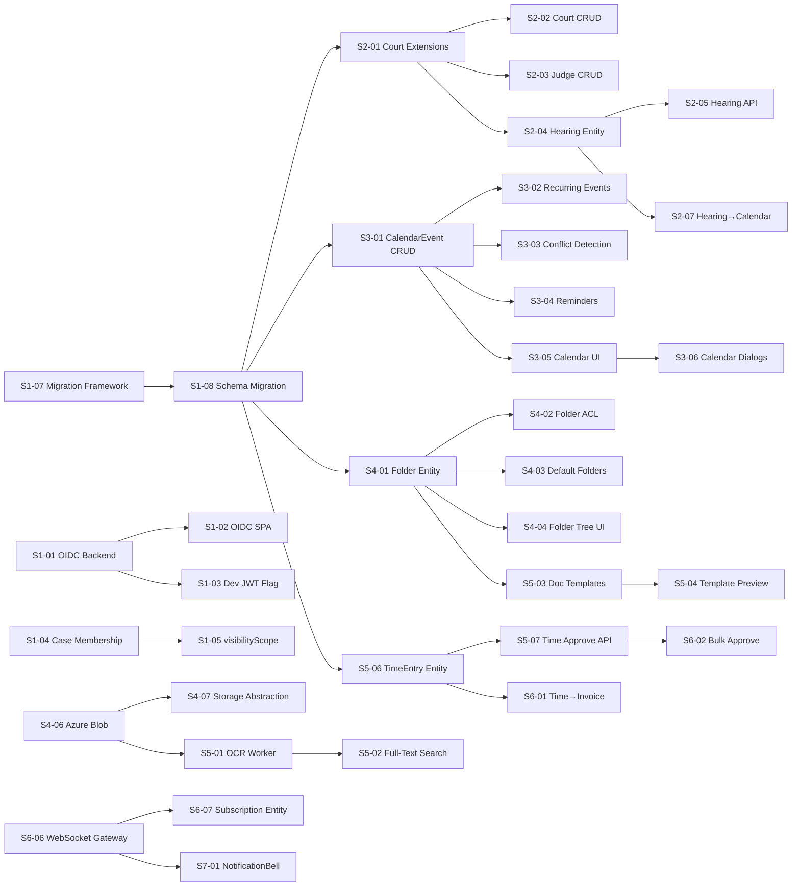

# Phase 2 Roadmap & Backlog
## Law Office Management Application (LOMA)

**Version:** 1.0  
**Date:** 2026-02-25  
**Baseline:** PHASE2_VISION_AND_METRICS.md, PHASE2_DOMAIN_MODEL_AND_WORKFLOWS.md  
**Scope:** Sprint plan, epic breakdown, story points, dependencies, milestones

---

## 1. Sprint Structure

| Parameter | Value |
|---|---|
| Sprint duration | 2 weeks |
| Total sprints | 8 (16 weeks) |
| Team assumption | 2 backend, 1 frontend, 1 QA, 1 DevOps (part-time) |
| Velocity estimate | 40 story points / sprint |
| Point scale | Fibonacci — 1, 2, 3, 5, 8, 13 |

---

## 2. Epic Overview

| Epic | ID | Sprints | Total SP | Driver |
|---|---|---|---|---|
| E1 — Foundation & Auth Upgrade | E1 | S1–S2 | 68 | D5, D1 |
| E2 — Court, Judge & Hearing | E2 | S2–S3 | 52 | D1, D3 |
| E3 — Calendar Module | E3 | S3–S4 | 61 | D2 |
| E4 — Document Management v2 | E4 | S4–S6 | 89 | D5 |
| E5 — Time Entry & Billing Integration | E5 | S5–S6 | 48 | D3 |
| E6 — Notifications & Real-Time | E6 | S6–S7 | 39 | D4 |
| E7 — UI Overhaul & Dashboards | E7 | S7–S8 | 55 | D4 |
| E8 — Hardening, Migration & Launch | E8 | S8 | 34 | All |
| **Total** | | | **446** | |

---

## 3. Sprint Plans

### Sprint 1 — Foundation (SP: 42)

| # | Story | Epic | SP | Depends On | Acceptance |
|---|---|---|---|---|---|
| S1-01 | OIDC/PKCE integration — backend OidcGuard, JWKS validation, tenant claim mapping | E1 | 8 | — | AC-AUTH-01 |
| S1-02 | OIDC SPA flow — PKCE redirect, silent refresh, token memory storage | E1 | 8 | S1-01 | AC-AUTH-02 |
| S1-03 | Dev-mode JWT feature flag (`AUTH_MODE=dev`) | E1 | 3 | S1-01 | AC-AUTH-03 |
| S1-04 | Case membership enforcement on all read endpoints | E1 | 5 | — | AC-SEC-01 |
| S1-05 | visibilityScope wiring — case participants, financial endpoints | E1 | 5 | S1-04 | AC-SEC-02 |
| S1-06 | Frontend test infrastructure — Vitest + React Testing Library setup | E1 | 3 | — | AC-TEST-01 |
| S1-07 | Database migration framework — versioned migration runner | E1 | 5 | — | AC-MIG-01 |
| S1-08 | Phase 2 DB schema migration — Court extensions, Judge, Hearing, Folder, CalendarEvent, TimeEntry tables | E1 | 5 | S1-07 | AC-MIG-02 |

### Sprint 2 — Court, Judge & Hearing Backend (SP: 44)

| # | Story | Epic | SP | Depends On | Acceptance |
|---|---|---|---|---|---|
| S2-01 | Court entity extensions — department, circuit, jurisdiction_level, is_active | E2 | 3 | S1-08 | AC-COURT-01 |
| S2-02 | Court CRUD API + TenantAdmin guard | E2 | 5 | S2-01 | AC-COURT-02 |
| S2-03 | Judge entity + CRUD API | E2 | 5 | S2-01 | AC-COURT-03 |
| S2-04 | Hearing entity + state machine (Scheduled→Completed/Postponed/Cancelled) | E2 | 8 | S2-01 | AC-HEAR-01 |
| S2-05 | Hearing CRUD + transition API | E2 | 5 | S2-04 | AC-HEAR-02 |
| S2-06 | Case ↔ Court/Judge FK linking | E2 | 3 | S2-01 | AC-COURT-04 |
| S2-07 | Hearing → CalendarEvent auto-creation | E2 | 5 | S2-04, S1-08 | AC-HEAR-03 |
| S2-08 | Admin UI — Court list + detail + Judge management | E2 | 8 | S2-02, S2-03 | AC-UI-COURT-01 |
| S2-09 | Step-up re-auth — cancel hearing, bulk approve actions | E1 | 2 | S1-01 | AC-SEC-03 |

### Sprint 3 — Calendar Core (SP: 40)

| # | Story | Epic | SP | Depends On | Acceptance |
|---|---|---|---|---|---|
| S3-01 | CalendarEvent entity + CRUD API | E3 | 5 | S1-08 | AC-CAL-01 |
| S3-02 | Recurring events — rrule parsing, instance generation | E3 | 8 | S3-01 | AC-CAL-02 |
| S3-03 | Conflict detection — overlapping check for attendees | E3 | 5 | S3-01 | AC-CAL-03 |
| S3-04 | CalendarReminder entity + CronJob scheduler | E3 | 5 | S3-01 | AC-CAL-04 |
| S3-05 | Calendar frontend — FullCalendar integration (month/week/day views) | E3 | 8 | S3-01 | AC-UI-CAL-01 |
| S3-06 | Calendar event CRUD dialogs + drag-resize | E3 | 5 | S3-05 | AC-UI-CAL-02 |
| S3-07 | Calendar ↔ Case filtered view | E3 | 3 | S3-05 | AC-CAL-05 |
| S3-08 | Calendar RTL layout support | E3 | 1 | S3-05 | AC-UI-CAL-03 |

### Sprint 4 — Document Management v2 Part 1 (SP: 42)

| # | Story | Epic | SP | Depends On | Acceptance |
|---|---|---|---|---|---|
| S4-01 | Folder entity + CRUD API (create, rename, move, archive, delete) | E4 | 5 | S1-08 | AC-FOLD-01 |
| S4-02 | Folder permission inheritance — ACL resolution chain | E4 | 8 | S4-01 | AC-FOLD-02 |
| S4-03 | Default folder templates — auto-create on case creation | E4 | 5 | S4-01 | AC-FOLD-03 |
| S4-04 | Folder tree UI — recursive tree, context menu, drag-drop move | E4 | 8 | S4-01 | AC-UI-FOLD-01 |
| S4-05 | Multi-file upload — drag-drop zone, parallel upload (3×), progress bars | E4 | 5 | S4-01 | AC-DOC-01 |
| S4-06 | Azure Blob storage provider — SAS tokens, lifecycle policies | E4 | 8 | — | AC-DOC-02 |
| S4-07 | Storage provider abstraction — runtime selection (MinIO / Azure Blob) | E4 | 3 | S4-06 | AC-DOC-03 |

### Sprint 5 — Document Management v2 Part 2 + Time Entry (SP: 44)

| # | Story | Epic | SP | Depends On | Acceptance |
|---|---|---|---|---|---|
| S5-01 | OCR Worker — Tesseract.js + BullMQ queue, ara+eng | E4 | 8 | S4-06 | AC-DOC-04 |
| S5-02 | Full-text search — tsvector/GIN index, search API with ts_headline | E4 | 5 | S5-01 | AC-DOC-05 |
| S5-03 | Document templates — Handlebars engine, CRUD API | E4 | 8 | S4-01 | AC-TMPL-01 |
| S5-04 | Template preview + generate API | E4 | 5 | S5-03 | AC-TMPL-02 |
| S5-05 | Template editor UI — Handlebars merge-field picker | E4 | 5 | S5-03 | AC-UI-TMPL-01 |
| S5-06 | TimeEntry entity + CRUD + state machine (Draft→Submitted→Approved→Billed) | E5 | 8 | S1-08 | AC-TIME-01 |
| S5-07 | Time entry submit/approve/reject API | E5 | 5 | S5-06 | AC-TIME-02 |

### Sprint 6 — Time Billing + Notifications (SP: 43)

| # | Story | Epic | SP | Depends On | Acceptance |
|---|---|---|---|---|---|
| S6-01 | Time entry → Invoice line item auto-population | E5 | 8 | S5-06 | AC-TIME-03 |
| S6-02 | Bulk time entry approval API + step-up guard | E5 | 5 | S5-07 | AC-TIME-04 |
| S6-03 | Timesheet UI — weekly grid, running timer widget, entry list | E5 | 8 | S5-06 | AC-UI-TIME-01 |
| S6-04 | External document sharing — time-limited SAS links | E4 | 5 | S4-06 | AC-DOC-06 |
| S6-05 | Configurable numbering schemes — case, invoice, document patterns | E4 | 3 | — | AC-DOC-07 |
| S6-06 | WebSocket gateway — Socket.IO + Redis adapter | E6 | 8 | — | AC-NOTIF-01 |
| S6-07 | Notification subscription entity + preferences API | E6 | 3 | S6-06 | AC-NOTIF-02 |
| S6-08 | Email notification sender (SMTP) | E6 | 3 | — | AC-NOTIF-03 |

### Sprint 7 — UI Overhaul + Dashboards (SP: 44)

| # | Story | Epic | SP | Depends On | Acceptance |
|---|---|---|---|---|---|
| S7-01 | NotificationBell + dropdown + toast overlay | E6 | 5 | S6-06 | AC-UI-NOTIF-01 |
| S7-02 | Notification preferences UI | E6 | 3 | S6-07 | AC-UI-NOTIF-02 |
| S7-03 | Lawyer dashboard — 6-widget responsive grid | E7 | 8 | S3-05, S5-06 | AC-UI-DASH-01 |
| S7-04 | Accountant dashboard — receivables, approvals, revenue trend | E7 | 5 | S6-01 | AC-UI-DASH-02 |
| S7-05 | Grouped sidebar navigation + mobile bottom tab bar | E7 | 5 | — | AC-UI-NAV-01 |
| S7-06 | Hearing list + detail UI (tabs: details, documents, notes, timeline) | E7 | 8 | S2-05 | AC-UI-HEAR-01 |
| S7-07 | Document library UI — folder browser + OCR search bar + bulk actions | E7 | 8 | S4-04, S5-02 | AC-UI-DOC-01 |
| S7-08 | Admin settings page — tenant profile, notification defaults, numbering | E7 | 2 | S6-05 | AC-UI-ADMIN-01 |

### Sprint 8 — Hardening & Launch (SP: 34)

| # | Story | Epic | SP | Depends On | Acceptance |
|---|---|---|---|---|---|
| S8-01 | ClamAV production scanner integration | E8 | 5 | S4-06 | AC-SEC-04 |
| S8-02 | Frontend test coverage ≥ 60% — critical paths | E8 | 8 | S1-06 | AC-TEST-02 |
| S8-03 | Performance benchmark — API P95 ≤ 500ms, search P95 ≤ 800ms | E8 | 5 | All APIs | AC-PERF-01 |
| S8-04 | WCAG 2.1 AA audit — all Phase 2 screens | E8 | 5 | All UIs | AC-A11Y-01 |
| S8-05 | Data migration script — existing docs to folder structure | E8 | 5 | S4-01 | AC-MIG-03 |
| S8-06 | End-to-end smoke tests — critical user flows | E8 | 3 | All | AC-TEST-03 |
| S8-07 | Production deployment runbook + rollback procedure | E8 | 2 | All | AC-OPS-01 |
| S8-08 | Documentation review + manifest finalization | E8 | 1 | All | AC-DOC-08 |

---

## 4. Dependency Graph

---

## 5. Milestones

| Milestone | Target Date | Criteria |
|---|---|---|
| **M1 — Auth & Security** | End Sprint 2 | OIDC live, case membership enforced, schema migrated |
| **M2 — Court & Calendar Live** | End Sprint 3 | Courts/judges/hearings CRUD, calendar 4-view functional |
| **M3 — Documents v2 Alpha** | End Sprint 5 | Folders, OCR, templates, multi-upload, search operational |
| **M4 — Billing Integration** | End Sprint 6 | Time entries → invoices, notifications real-time |
| **M5 — UI Refresh** | End Sprint 7 | All dashboards, navigation overhaul, all Phase 2 screens |
| **M6 — Production Ready** | End Sprint 8 | Perf benchmarks met, WCAG pass, migration done, ≥ 60% FE coverage |

---

## 6. Risk-Adjusted Buffer

- **Buffer sprints:** 1 additional sprint (Sprint 9) reserved for overflow / defect fixing
- **Scope cut priority:** P2 features (F-DOC-08, F-DOC-10, F-DOC-11, F-DOC-12) are first candidates for deferral if velocity underperforms
- **Velocity recalibration:** Re-evaluate at Sprint 3 retrospective; adjust Sprint 4–8 scope if average velocity < 35 SP

---

## 7. Definition of Done (Per Story)

1. Code reviewed and merged to `develop`
2. Unit tests pass (≥ 80% line coverage for new code)
3. Integration / e2e tests pass for API stories
4. Frontend component tests pass for UI stories
5. Acceptance criteria verified by QA
6. No P0/P1 bugs open
7. API documentation updated (Swagger annotations)
8. Audit events emitted for state-changing operations
9. No console.log in committed code
