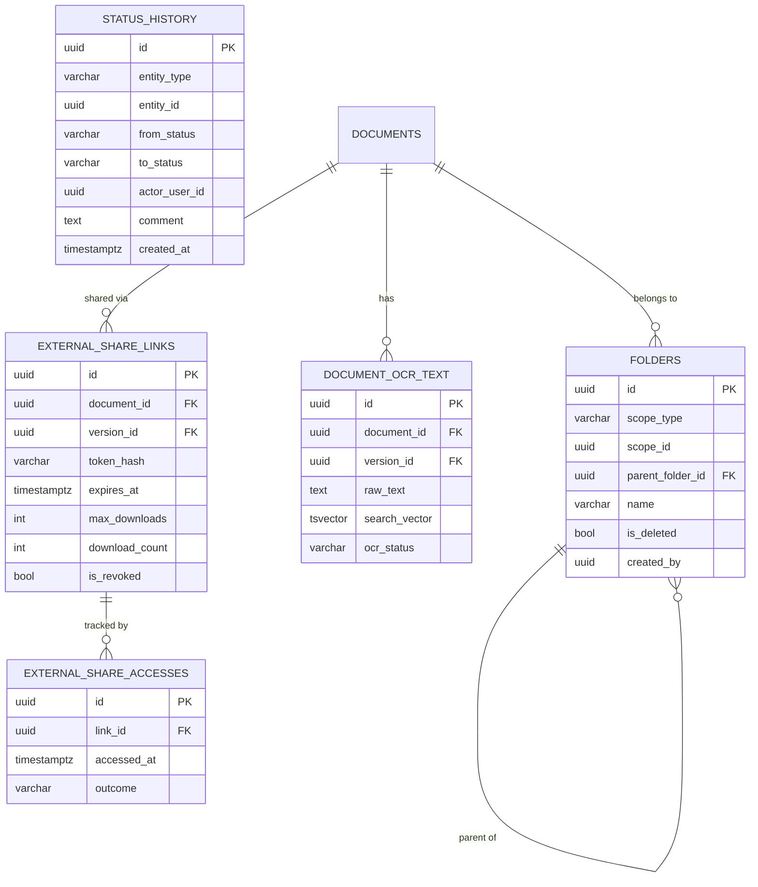

# LOMA — Phase 3 Technical Design Document (TDD)

> **Version**: 3.0  
> **Status**: Draft — Ready for Implementation  
> **Stack**: NestJS 10 · Next.js 14 (App Router) · PostgreSQL 15 · Redis 7 · BullMQ · MinIO · MUI v5  
> **References**: P3_BRD.md · P3_PRD.md · `backend/prisma/tenant-schema.sql` · existing Phase 2 architecture

---

## 1. Architectural Decisions (Phase 3)

| # | Decision | Rationale |
|---|----------|-----------|
| AD-01 | **Generic `status_history` table** keyed by `(entity_type, entity_id)` — not per-entity tables. | Minimizes schema proliferation; one timeline component serves all entities. |
| AD-02 | **SSE (Server-Sent Events)** for real-time notifications, not WebSocket. | Simpler infrastructure; HTTP/2 multiplexing; no separate WS server needed. |
| AD-03 | **BullMQ** reused for OCR jobs (new queue `ocr`) alongside existing `document-scan` queue. | Consistent job infrastructure; Loki/Grafana already wired for worker logs. |
| AD-04 | **Approval engine** implemented as a generic `ApprovalService` with entity-specific adapters (`WageApprovalAdapter`, `InvoiceApprovalAdapter`). | Prevents copy-paste logic; adapters provide entity-specific guards and notifications. |
| AD-05 | **Dashboard KPIs cached in Redis** with 60-second TTL per tenant. | Avoids expensive aggregation queries on every page load; invalidated on relevant mutations. |
| AD-06 | **OCR via Tesseract** (`tesseract.js` npm package or separate `tesseract` Docker service). | Zero cloud cost; acceptable quality for Arabic + English legal text. |
| AD-07 | **External share tokens**: 32-byte `crypto.randomBytes` → base64url, stored hashed (SHA-256) in DB. | Token never stored in plain text; same pattern as refresh tokens. |
| AD-08 | **`folder_id` on `documents`** — new nullable FK to `folders` table (existing table, previously broken — Phase 3 completes its implementation). | Reuse existing table structure from BRD; fix folder scoping (was `case_id`, now generic `scope_type` + `scope_id`). |

---

## 2. Database Schema — Phase 3 Migrations

All changes are additive (backward-compatible).  Each section corresponds to one migration file.

### 2.1 Migration: Customer Enrichment

```sql
-- file: backend/prisma/migrations/p3_01_customer_enrichment.sql
ALTER TABLE customers
  ADD COLUMN IF NOT EXISTS kyc_status           VARCHAR(20)  NOT NULL DEFAULT 'NotStarted'
                                                CHECK (kyc_status IN ('NotStarted','InProgress','Verified','Rejected')),
  ADD COLUMN IF NOT EXISTS kyc_verified_at      TIMESTAMPTZ,
  ADD COLUMN IF NOT EXISTS credit_rating        VARCHAR(10)
                                                CHECK (credit_rating IN ('AAA','AA','A','BBB','BB','B','Unrated')),
  ADD COLUMN IF NOT EXISTS preferred_language   VARCHAR(5)   DEFAULT 'en',
  ADD COLUMN IF NOT EXISTS preferred_comm_channel VARCHAR(20)
                                                CHECK (preferred_comm_channel IN ('Email','Phone','WhatsApp','Post')),
  ADD COLUMN IF NOT EXISTS relationship_manager_user_id UUID,
  ADD COLUMN IF NOT EXISTS industry_sector      VARCHAR(200),
  ADD COLUMN IF NOT EXISTS risk_profile         VARCHAR(10)
                                                CHECK (risk_profile IN ('Low','Medium','High')),
  ADD COLUMN IF NOT EXISTS date_of_birth        DATE,
  ADD COLUMN IF NOT EXISTS incorporation_date   DATE,
  ADD COLUMN IF NOT EXISTS gender               VARCHAR(15)
                                                CHECK (gender IN ('Male','Female','NotSpecified')),
  ADD COLUMN IF NOT EXISTS annual_revenue_band  VARCHAR(20)
                                                CHECK (annual_revenue_band IN ('<1M','1M-10M','10M-100M','>100M'));
```

### 2.2 Migration: Case Enrichment

```sql
-- file: backend/prisma/migrations/p3_02_case_enrichment.sql
ALTER TABLE cases
  ADD COLUMN IF NOT EXISTS risk_level           VARCHAR(10)  DEFAULT 'Low'
                                                CHECK (risk_level IN ('Low','Medium','High','Critical')),
  ADD COLUMN IF NOT EXISTS priority             VARCHAR(10)  DEFAULT 'Normal'
                                                CHECK (priority IN ('Normal','Urgent','Emergency')),
  ADD COLUMN IF NOT EXISTS source               VARCHAR(20)
                                                CHECK (source IN ('Referral','Direct','Government','Repeat')),
  ADD COLUMN IF NOT EXISTS estimated_value      DECIMAL(18,2),
  ADD COLUMN IF NOT EXISTS legal_acts           JSONB        NOT NULL DEFAULT '[]',
  ADD COLUMN IF NOT EXISTS judgment_date        DATE,
  ADD COLUMN IF NOT EXISTS judgment_outcome     TEXT,
  ADD COLUMN IF NOT EXISTS judgment_reference   VARCHAR(200),
  ADD COLUMN IF NOT EXISTS appeal_deadline      DATE,
  ADD COLUMN IF NOT EXISTS lead_lawyer_user_id  UUID,
  ADD COLUMN IF NOT EXISTS junior_lawyers       UUID[]       NOT NULL DEFAULT '{}';
```

Opposing counsel enrichment is added to `case_parties` (existing table):

```sql
ALTER TABLE case_parties
  ADD COLUMN IF NOT EXISTS opposing_counsel_name   VARCHAR(300),
  ADD COLUMN IF NOT EXISTS opposing_counsel_firm   VARCHAR(300),
  ADD COLUMN IF NOT EXISTS opposing_counsel_email  VARCHAR(300),
  ADD COLUMN IF NOT EXISTS opposing_counsel_phone  VARCHAR(100),
  ADD COLUMN IF NOT EXISTS opposing_counsel_bar_no VARCHAR(100);
```

### 2.3 Migration: Session Enrichment

```sql
-- file: backend/prisma/migrations/p3_03_session_enrichment.sql
ALTER TABLE sessions
  ADD COLUMN IF NOT EXISTS judge_id                   UUID REFERENCES judges(id),
  ADD COLUMN IF NOT EXISTS witness_list               JSONB  NOT NULL DEFAULT '[]',
  ADD COLUMN IF NOT EXISTS actual_outcome             TEXT,
  ADD COLUMN IF NOT EXISTS actual_start_time          TIMESTAMPTZ,
  ADD COLUMN IF NOT EXISTS actual_end_time            TIMESTAMPTZ,
  ADD COLUMN IF NOT EXISTS is_billable                BOOLEAN DEFAULT FALSE,
  ADD COLUMN IF NOT EXISTS billable_duration_minutes  INT,
  ADD COLUMN IF NOT EXISTS postponed_from_session_id  UUID REFERENCES sessions(id);
```

### 2.4 Migration: Wage Approval States

```sql
-- file: backend/prisma/migrations/p3_04_wage_approval.sql
-- Extend payment_status enum
ALTER TABLE wages
  DROP CONSTRAINT IF EXISTS wages_payment_status_check;

ALTER TABLE wages
  ADD CONSTRAINT wages_payment_status_check
  CHECK (payment_status IN ('Draft','Submitted','Approved','Paid')),
  ADD COLUMN IF NOT EXISTS submitted_at   TIMESTAMPTZ,
  ADD COLUMN IF NOT EXISTS submitted_by   UUID,
  ADD COLUMN IF NOT EXISTS approved_at    TIMESTAMPTZ,
  ADD COLUMN IF NOT EXISTS approved_by    UUID,
  ADD COLUMN IF NOT EXISTS paid_at        TIMESTAMPTZ,
  ADD COLUMN IF NOT EXISTS paid_by        UUID,
  ADD COLUMN IF NOT EXISTS payment_method VARCHAR(30),
  ADD COLUMN IF NOT EXISTS payment_ref    VARCHAR(300);

-- Migrate existing 'Planned' → 'Draft', 'Paid' stays 'Paid'
UPDATE wages SET payment_status = 'Draft' WHERE payment_status = 'Planned';
```

### 2.5 Migration: Invoice Review Step

```sql
-- file: backend/prisma/migrations/p3_05_invoice_review.sql
ALTER TABLE invoices
  DROP CONSTRAINT IF EXISTS invoices_status_check;

ALTER TABLE invoices
  ADD CONSTRAINT invoices_status_check
  CHECK (status IN ('Draft','Review','Approved','Finalized','Sent','Paid','Void')),
  ADD COLUMN IF NOT EXISTS reviewed_by   UUID,
  ADD COLUMN IF NOT EXISTS reviewed_at   TIMESTAMPTZ,
  ADD COLUMN IF NOT EXISTS review_comment TEXT;
```

### 2.6 Migration: Status History (Generic)

```sql
-- file: backend/prisma/migrations/p3_06_status_history.sql
CREATE TABLE IF NOT EXISTS status_history (
  id            UUID         PRIMARY KEY DEFAULT gen_random_uuid(),
  entity_type   VARCHAR(50)  NOT NULL,  -- 'case','invoice','expense','wage','filing','document'
  entity_id     UUID         NOT NULL,
  from_status   VARCHAR(50),            -- NULL for initial creation
  to_status     VARCHAR(50)  NOT NULL,
  actor_user_id UUID,
  comment       TEXT,
  metadata      JSONB        DEFAULT '{}', -- additional context (e.g. payment_method on Paid)
  created_at    TIMESTAMPTZ  NOT NULL DEFAULT NOW()
);

CREATE INDEX idx_status_history_entity ON status_history (entity_type, entity_id, created_at DESC);
CREATE INDEX idx_status_history_actor  ON status_history (actor_user_id);
```

### 2.7 Migration: Document Folder Hierarchy (Fix + Extend)

```sql
-- file: backend/prisma/migrations/p3_07_folders_fix.sql
-- DROP broken folders table and recreate cleanly
DROP TABLE IF EXISTS folders CASCADE;

CREATE TABLE folders (
  id            UUID         PRIMARY KEY DEFAULT gen_random_uuid(),
  scope_type    VARCHAR(20)  NOT NULL CHECK (scope_type IN ('case','customer','tenant')),
  scope_id      UUID         NOT NULL,
  parent_folder_id UUID      REFERENCES folders(id) ON DELETE CASCADE,
  name          VARCHAR(300) NOT NULL,
  is_deleted    BOOLEAN      DEFAULT FALSE,
  created_by    UUID         NOT NULL,
  created_at    TIMESTAMPTZ  NOT NULL DEFAULT NOW(),
  updated_at    TIMESTAMPTZ  NOT NULL DEFAULT NOW(),
  UNIQUE (scope_type, scope_id, parent_folder_id, name) -- unique name within same parent
);

CREATE INDEX idx_folders_scope ON folders (scope_type, scope_id);

-- Add folder_id to documents
ALTER TABLE documents ADD COLUMN IF NOT EXISTS folder_id UUID REFERENCES folders(id);
ALTER TABLE documents ADD COLUMN IF NOT EXISTS expires_at TIMESTAMPTZ;
```

### 2.8 Migration: Document OCR Text

```sql
-- file: backend/prisma/migrations/p3_08_document_ocr.sql
CREATE TABLE IF NOT EXISTS document_ocr_text (
  id            UUID         PRIMARY KEY DEFAULT gen_random_uuid(),
  document_id   UUID         NOT NULL REFERENCES documents(id),
  version_id    UUID         NOT NULL REFERENCES document_versions(id),
  raw_text      TEXT,
  search_vector TSVECTOR GENERATED ALWAYS AS (to_tsvector('arabic', coalesce(raw_text,'')) || to_tsvector('english', coalesce(raw_text,''))) STORED,
  ocr_status    VARCHAR(20)  NOT NULL DEFAULT 'Pending'
                             CHECK (ocr_status IN ('Pending','Processing','Done','Failed')),
  created_at    TIMESTAMPTZ  NOT NULL DEFAULT NOW(),
  UNIQUE(document_id, version_id)
);

CREATE INDEX idx_ocr_search ON document_ocr_text USING gin(search_vector);
```

### 2.9 Migration: External Share Links

```sql
-- file: backend/prisma/migrations/p3_09_external_shares.sql
CREATE TABLE IF NOT EXISTS external_share_links (
  id             UUID         PRIMARY KEY DEFAULT gen_random_uuid(),
  document_id    UUID         NOT NULL REFERENCES documents(id),
  version_id     UUID         REFERENCES document_versions(id), -- null = current version
  token_hash     VARCHAR(128) NOT NULL UNIQUE, -- SHA-256 of token
  expires_at     TIMESTAMPTZ  NOT NULL,
  max_downloads  INT          NOT NULL DEFAULT 1,
  download_count INT          NOT NULL DEFAULT 0,
  password_hash  VARCHAR(200),              -- bcrypt; null = no password
  is_revoked     BOOLEAN      NOT NULL DEFAULT FALSE,
  created_by     UUID         NOT NULL,
  created_at     TIMESTAMPTZ  NOT NULL DEFAULT NOW()
);

CREATE TABLE IF NOT EXISTS external_share_accesses (
  id            UUID         PRIMARY KEY DEFAULT gen_random_uuid(),
  link_id       UUID         NOT NULL REFERENCES external_share_links(id),
  accessed_at   TIMESTAMPTZ  NOT NULL DEFAULT NOW(),
  ip_address    VARCHAR(50),
  user_agent    TEXT,
  outcome       VARCHAR(20)  NOT NULL CHECK (outcome IN ('Success','Expired','Invalid','MaxReached','WrongPassword'))
);
```

### 2.10 Migration: Session Postponement Approval

```sql
-- file: backend/prisma/migrations/p3_10_session_postponement.sql
ALTER TABLE session_reschedules
  ADD COLUMN IF NOT EXISTS approval_status    VARCHAR(20) DEFAULT 'Approved'
                                              CHECK (approval_status IN ('PendingApproval','Approved','Rejected')),
  ADD COLUMN IF NOT EXISTS approved_by        UUID,
  ADD COLUMN IF NOT EXISTS approval_comment   TEXT,
  ADD COLUMN IF NOT EXISTS decided_at         TIMESTAMPTZ;
```

---

## 3. Backend Module Changes

### 3.1 New Module: `approval`

```
backend/src/approval/
  approval.module.ts
  approval.service.ts          -- generic engine
  approval.types.ts            -- interfaces: ApprovalAdapter, ApprovalContext
  adapters/
    wage.adapter.ts
    invoice.adapter.ts
    session-postponement.adapter.ts
  dto/
    approve.dto.ts             -- { comment?: string }
    reject.dto.ts              -- { comment: string }
```

**`ApprovalService`** methods:
- `submit(entityType, entityId, submittingUserId, ctx): Promise<void>`
- `approve(entityType, entityId, actorUserId, comment?, ctx): Promise<void>`
- `reject(entityType, entityId, actorUserId, comment, ctx): Promise<void>`

Each adapter implements:
- `getEntity(id, db)` — load entity with lock
- `validateSubmitter(entity, userId)` — role/state checks
- `validateApprover(entity, userId, role)` — role-gate; block self-approval
- `applyTransition(entity, action, db)` — update table
- `onTransition(entity, action, db)` — send notifications

### 3.2 New Module: `status-history`

```
backend/src/status-history/
  status-history.module.ts
  status-history.service.ts    -- emit() + findByEntity()
```

**`StatusHistoryService`**:
- `emit({ entityType, entityId, fromStatus, toStatus, actorUserId, comment?, metadata? }, db?)`: inserts into `status_history`.
  - Accepts an optional `PoolClient` to run within the caller's transaction.
- `findByEntity(entityType, entityId, tenantSchema)`: returns ordered entries.

All existing service methods that transition status must call `StatusHistoryService.emit()` inside the same DB transaction.

### 3.3 New Module: `notifications` (enhancement)

```
backend/src/notifications/
  notifications.module.ts
  notifications.service.ts     -- create + SSE delivery
  notifications.gateway.ts     -- SSE controller-level handler
  notifications.scheduler.ts   -- cron jobs: digest, hearing-alert, deadline
  dto/
    notification-preferences.dto.ts
```

**SSE Endpoint**: `GET /api/v1/notifications/stream` (requires auth; returns `text/event-stream`).  
- Redis Pub/Sub channel per tenant: `notif:{tenantId}:{userId}`.  
- Backend publishes events after notification record created.  
- Client subscribes and appends to notification list without polling.

**Cron schedules** (using `@nestjs/schedule`):
- `0 7 * * *` — Hearing day-of alert (07:00 UTC).
- `0 8 * * *` — Task + document expiry deadline reminders.
- `0 9 * * 1` — Weekly email digest (Monday 09:00 UTC).
- `0 9 * * *` — Daily email digest.

### 3.4 New Module: `ocr`

```
backend/src/ocr/
  ocr.module.ts
  ocr.processor.ts     -- BullMQ processor for 'ocr' queue
  ocr.service.ts       -- tesseract wrapper + DB write
```

**Queue**: `ocr` (separate from `document-scan`).  
**Producer**: `DocumentsService.handleScanPassed()` enqueues `{ documentId, versionId, objectKey }`.  
**Processor**: downloads object from MinIO → runs Tesseract → writes `document_ocr_text` record.

### 3.5 Enhancements to Existing Modules

| Module | Change |
|--------|--------|
| `customers` | CRUD methods updated to read/write enrichment columns; `status_history` emitted on kyc_status change. |
| `cases` | Legal acts JSONB validated; enrichment columns read/write; `status_history` emitted on every transition. |
| `sessions` | Witness list JSONB; postponement approval flow; `is_billable` + `billable_duration_minutes` in complete-session endpoint. |
| `wages` | State machine enforced: Draft→Submitted→Approved→Paid; all existing `Planned` data migrated to `Draft`. |
| `invoices` | `Review` step inserted when `invoiceApprovalRequired` tenant setting is `true`; `status_history` emitted on all transitions. |
| `documents` | `folder_id` and `expires_at` columns; bulk operations endpoint; external share endpoints; OCR trigger after scan pass. |
| `folders` | Complete reimplementation on fixed schema; CRUD + tree queries. |
| `reports` | New aggregate endpoints; Redis caching with 60s TTL; `.xlsx` export via `exceljs`. |

---

## 4. API Additions (Phase 3)

### 4.1 Status History

```
GET /api/v1/status-history?entityType={type}&entityId={id}
```
Response: `{ data: StatusHistoryEntry[] }`

### 4.2 Approval Engine

```
POST /api/v1/wages/{id}/submit
POST /api/v1/wages/{id}/approve     body: { comment? }
POST /api/v1/wages/{id}/reject      body: { comment }    [comment required]
POST /api/v1/wages/{id}/mark-paid   body: { paymentMethod, paymentRef?, paidAt? }

POST /api/v1/invoices/{id}/submit-for-review
POST /api/v1/invoices/{id}/approve-review   body: { comment? }
POST /api/v1/invoices/{id}/reject-review    body: { comment }

POST /api/v1/sessions/{sessionId}/reschedule/submit   body: { requestedDate, reason }
POST /api/v1/sessions/{sessionId}/reschedule/{rescheduleId}/approve
POST /api/v1/sessions/{sessionId}/reschedule/{rescheduleId}/reject   body: { comment }
```

### 4.3 Folders

```
POST   /api/v1/folders                    body: { scopeType, scopeId, parentFolderId?, name }
GET    /api/v1/folders?scopeType=&scopeId=   (returns tree structure)
PATCH  /api/v1/folders/{id}               body: { name?, parentFolderId? }
DELETE /api/v1/folders/{id}               (soft delete)
```

### 4.4 Document Bulk Operations

```
POST /api/v1/documents/bulk/move          body: { documentIds: UUID[], folderId: UUID | null }
POST /api/v1/documents/bulk/tag           body: { documentIds: UUID[], tags: string[] }
POST /api/v1/documents/bulk/delete        body: { documentIds: UUID[] }
POST /api/v1/documents/bulk/confidentiality   body: { documentIds: UUID[], level: string }
```

### 4.5 External Share Links

```
POST   /api/v1/documents/{id}/external-shares
         body: { versionId?, expiresIn: '1h'|'24h'|'7d'|'30d', maxDownloads: 1..10, password? }
DELETE /api/v1/documents/{id}/external-shares/{linkId}   (revoke)
GET    /api/v1/documents/{id}/external-shares            (list for document owner)

GET    /share/{token}          (public; optional query ?password=; returns signed download URL or error)
```

### 4.6 OCR Search

```
GET /api/v1/documents?scope={case|customer}&scopeId={id}&search={term}
```
Backend: `WHERE (documents.title ILIKE '%{term}%' OR document_ocr_text.search_vector @@ plainto_tsquery('english|arabic', {term}))`

### 4.7 Notifications & SSE

```
GET  /api/v1/notifications               (paginated list)
POST /api/v1/notifications/{id}/read
POST /api/v1/notifications/read-all
GET  /api/v1/notifications/stream        (SSE)
GET  /api/v1/notifications/preferences
PATCH /api/v1/notifications/preferences body: { emailDigest: 'None'|'Daily'|'Weekly', ... }
```

### 4.8 Reports (Enhanced)

```
GET /api/v1/reports/dashboard-kpis           (cached 60s)
GET /api/v1/reports/case-aging?format=json|csv|xlsx
GET /api/v1/reports/receivables-aging?format=json|csv|xlsx
GET /api/v1/reports/lawyer-utilization?year=&month=&format=json|csv|xlsx
GET /api/v1/reports/expense-breakdown?year=&format=json|csv|xlsx
```

---

## 5. Frontend Architecture (Phase 3)

### 5.1 New Shared Components

| Component | Path | Purpose |
|-----------|------|---------|
| `StatusTimeline` | `components/StatusTimeline.tsx` | Generic vertical MUI Timeline; accepts `StatusHistoryEntry[]`. |
| `ApprovalActions` | `components/ApprovalActions.tsx` | Role-gated action buttons (Submit / Approve / Reject / Mark Paid) + dialog. |
| `ApprovalQueueTable` | `components/ApprovalQueueTable.tsx` | Combined table for wages (Submitted) + invoices (Review) + expenses (PendingApproval). |
| `FolderTree` | `components/FolderTree.tsx` | Recursive MUI TreeView; context menu; drag-and-drop via `dnd-kit`. |
| `DocumentBulkBar` | `components/DocumentBulkBar.tsx` | Floating action bar when documents are selected. |
| `ExternalShareDialog` | `components/ExternalShareDialog.tsx` | Dialog for creating share links with config options. |
| `NotificationCenter` | `components/NotificationCenter.tsx` | Slide-out drawer; SSE hook; unread badge. |
| `KpiCard` | `components/KpiCard.tsx` | Dashboard metric card (value, label, trend indicator). |
| `AgingChart` | `components/AgingChart.tsx` | Recharts bar chart for aging/utilization reports (reusable). |
| `WitnessListEditor` | `components/WitnessListEditor.tsx` | Inline add/remove rows for witness list JSONB. |
| `LegalActsEditor` | `components/LegalActsEditor.tsx` | Inline add/remove rows for legal acts JSONB array. |

### 5.2 New / Modified Pages

| Page | Route | Change |
|------|-------|--------|
| Dashboard | `/` | New KPI widgets; add chart panels. |
| Customer Detail | `/customers/[id]` | "KYC & Profile" tab; status timeline section. |
| Case Detail | `/cases/[id]` | Enrich Overview tab; Judgment card; Legal Acts; status timeline on Timeline tab. |
| Session Detail | (within Case) | Witness list; actual time/outcome; billable; postponement chain breadcrumb. |
| Documents | `/documents` | Folder tree sidebar; bulk select bar; expiry column; search bar with OCR. |
| Accounting / Wages | `/accounting` (Wages tab) | Approval state column; Submit / Approve / Reject actions. |
| Accounting / Invoices | Invoice detail | Review step UI (when toggle enabled). |
| Accounting / Approval Queue | `/accounting` (Approval Queue tab) | New tab; combined queue. |
| Reports | `/reports` | New report pages; chart widgets; Excel export. |
| Admin / Settings | `/admin/settings` | `invoiceApprovalRequired` toggle; notification preferences. |

### 5.3 SSE Hook

```typescript
// hooks/useNotifications.ts
export function useNotifications() {
  const [notifications, setNotifications] = useState<Notification[]>([]);
  const [unreadCount, setUnreadCount] = useState(0);

  useEffect(() => {
    const es = new EventSource('/api/v1/notifications/stream', { withCredentials: true });
    es.onmessage = (e) => {
      const notif = JSON.parse(e.data);
      setNotifications(prev => [notif, ...prev]);
      setUnreadCount(c => c + 1);
    };
    return () => es.close();
  }, []);

  return { notifications, unreadCount, markAllRead };
}
```

---

## 6. Security Considerations

| Area | Implementation |
|------|----------------|
| External share token | 32-byte `crypto.randomBytes` → base64url; stored as `SHA-256(token)` in DB.  Plain token returned once at creation only. |
| External share download | Rate-limited at Nginx (10 req/min per IP); no auth required but token is high-entropy. |
| Self-approval block | `ApprovalService` checks `submittedBy === actorUserId`; returns `403 ForbiddenException`. |
| Status history tampering | `status_history` is insert-only; no UPDATE/DELETE endpoints.  Tenant Admin may add corrective entries only. |
| OCR text sensitivity | OCR text inherits document confidentiality.  `HighlyConfidential` document OCR text excluded from search results for users without ACL grant. |
| SSE auth | SSE endpoint guarded by `JwtAuthGuard`; JWT passed via `Authorization` header (EventSource with credentials). |

---

## 7. Testing Strategy (Phase 3)

| Layer | Scope |
|-------|-------|
| **Unit** | `ApprovalService` (all transitions, self-approval block, state guards); `StatusHistoryService.emit()`; token generation. |
| **Integration** | Wage approval full lifecycle (4 steps); Invoice with and without `invoiceApprovalRequired`; Session postponement approve/reject; External share link create → access → max-download expire. |
| **E2E (Playwright)** | Dashboard KPI loads; Document folder create/move; Status timeline visible on Case Detail; Notification bell badge increments. |
| **Regression** | All 195 existing Phase 2 Jest tests must remain green. |

---

## 8. Deployment Notes

### 8.1 Docker Compose Additions

```yaml
# docker-compose.yml additions for Phase 3
  tesseract:
    image: tesseractocr/tesseract:latest
    # called via exec from ocr worker; or run as sidecar HTTP service
    # Recommendation: wrap in a simple Express/FastAPI microservice or use tesseract.js npm in worker

  # No new services required if tesseract.js npm package used in backend worker
```

### 8.2 Environment Variables (New)

```env
# .env additions
OCR_ENABLED=true
OCR_LANGUAGES=eng+ara
NOTIFICATION_EMAIL_FROM=noreply@loma.app
SMTP_HOST=
SMTP_PORT=587
SMTP_USER=
SMTP_PASS=
EXTERNAL_SHARE_BASE_URL=http://localhost:3000
INVOICE_APPROVAL_REQUIRED=false     # tenant-level default; overridable per-tenant in DB
DASHBOARD_CACHE_TTL_SECONDS=60
```

### 8.3 Migration Execution Order

```
p3_01_customer_enrichment.sql
p3_02_case_enrichment.sql
p3_03_session_enrichment.sql
p3_04_wage_approval.sql          ← migrates 'Planned' → 'Draft'
p3_05_invoice_review.sql
p3_06_status_history.sql
p3_07_folders_fix.sql            ← drops & recreates folders; adds folder_id + expires_at to documents
p3_08_document_ocr.sql
p3_09_external_shares.sql
p3_10_session_postponement.sql
p3_11_seed_status_history.sql    ← backfill creation events for all existing entities
```

Each migration is wrapped in a transaction with an explicit `ROLLBACK` script.

---

## 9. ERD Additions (Mermaid)




## 10. Rich Document Upload Integration Blueprint

### 10.1 Backend Additions
- New endpoint for context-aware upload bootstrap:
  - `POST /api/v1/documents/upload-sessions`
  - Body: `{ originModule, originEntityType, originEntityId, files[], defaults }`
  - Response: per-file signed URLs + server-side validation results.
- New finalize endpoint to persist metadata + origin backlinks atomically after object upload:
  - `POST /api/v1/documents/upload-sessions/{id}/finalize`
- Origin trace columns on `documents`:
  - `origin_module VARCHAR(50)`
  - `origin_entity_type VARCHAR(50)`
  - `origin_entity_id UUID`

### 10.2 Frontend Integration Contract
- Shared component: `components/RichDocumentUpload.tsx`
- Shared hook: `hooks/useRichUploadQueue.ts`
- Required host props: `scopeType`, `scopeId`, `originModule`, `defaultDocType`, `requiredMetadataSchema`
- Host modules to integrate:
  - CaseDetailDocuments
  - CustomerKycPanel
  - SessionForm / HearingForm
  - FilingForm
  - ExpenseForm / InvoiceForm
  - TaskDrawer
  - CommunicationDrawer

### 10.3 Event and Timeline Projection
- Each successful upload emits `DOCUMENT_UPLOADED` with origin metadata.
- Case/Customer/Finance activity feeds project upload events with deep-links to Document Detail.
- Status timeline for document includes queue stage transitions for operational transparency.

### 10.4 Operational Constraints
- Queue concurrency configurable per tenant profile (default 3).
- Upload session TTL default 20 minutes, renewable once by client.
- Max aggregate payload per batch configurable (default 500MB) while preserving per-file cap.
